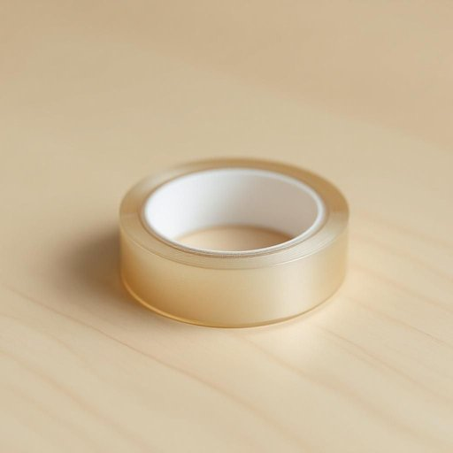

# tape

<h1 style="font-size: 2.5em; font-weight: 300; letter-spacing: 2px; margin: 0; color: #2c3e50;">
/teɪp/
</h1>

---

---

## 例句

Could you please pass me the tape that's sitting next to the scissors on the kitchen counter, the one with the glossy finish and slightly worn edges, because I need to secure the loose cable behind the TV before we start the movie?

*Could(/kʊd/) you(/ju/) please(/pliz/) pass(/pæs/) me(/mi/) the(/ðə/) tape(/teɪp/) that's(/ðæts/) sitting(/ˈsɪtɪŋ/) next(/nɛkst/) to(/tɪ/) the(/ðə/) scissors(/ˈsɪzərz/) on(/ɔn/) the(/ðə/) kitchen(/ˈkɪʧən/) counter,(/ˈkaʊntər,/) the(/ðə/) one(/wən/) with(/wɪθ/) the(/ðə/) glossy(/ˈglɔsi/) finish(/ˈfɪnɪʃ/) and(/ənd/) slightly(/sˈlaɪtli/) worn(/wɔrn/) edges,(/ˈɛʤɪz,/) because(/bɪˈkəz/) I(/aɪ/) need(/nid/) to(/tɪ/) secure(/sɪˈkjʊr/) the(/ðə/) loose(/lus/) cable(/ˈkeɪbəl/) behind(/bɪˈhaɪnd/) the(/ðə/) TV(/ˌtɛləˈvɪʒən/) before(/ˌbiˈfɔr/) we(/wi/) start(/stɑrt/) the(/ðə/) movie?(/ˈmuvi?/)*

**翻译：** 你能把厨房台面上剪刀旁边那卷带有光滑表面且边缘略显磨损的胶带递给我吗？我需要用它固定电视后面松散的电线，然后我们才能开始看电影。

---

## 解释

英语单词“tape”作为名词在家居生活用品的场景中，主要指的是一种用于粘合、固定或封闭物品的薄条状材料，常见的有透明胶带、布基胶带、电工胶带等，使用场合包括封箱、修补、装饰或整理物品等。英语学习者在使用“tape”时需注意其不可数名词和可数名词的区别，通常指整体材料时用作不可数名词，如“Can you pass me some tape?”表示“你能把胶带递给我吗？”，而指具体某卷胶带或某段胶带时可视为可数名词，如“a roll of tape”（一卷胶带）。 “tape”常与动词“roll”（卷）搭配，或与形容词如“sticky”（粘性的）、“transparent”（透明的）等连用，表达更具体的属性。词源上，“tape”源自古法语“tape”，进而来自中世纪拉丁语“tapea”，意思是织带或带子，反映了其作为带状物质的本质。在中文语境中，“tape”准确翻译为“胶带”，有时需根据具体种类翻译为“透明胶带”、“布基胶带”等，强调其粘合功能和形态。该词在家庭生活中没有特殊的褒贬含义或文化色彩，是一个中性且实用的名词，用以指代生活中常见的辅助性粘合物品。

---

<small style="color: #999; font-size: 0.9em;">2025-07-27 09:14:04</small>

