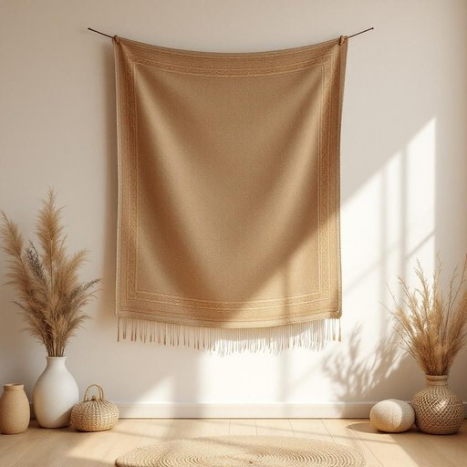

# tapestry

<h1 style="font-size: 2.5em; font-weight: 300; letter-spacing: 2px; margin: 0; color: #2c3e50;">
/ˈtæpəstri/
</h1>

---

---

## 例句

The tapestry, woven with intricate patterns and rich earthy tones, not only enhances the vintage charm of the living room but also captivates guests with its detailed craftsmanship, making it a centerpiece of conversation and admiration.

*The(/ðə/) tapestry,(/ˈtæpəstri,/) woven(/ˈwoʊvən/) with(/wɪθ/) intricate(/ˈɪntrəkət/) patterns(/ˈpætərnz/) and(/ənd/) rich(/rɪʧ/) earthy(/ˈərθi/) tones,(/toʊnz,/) not(/nɑt/) only(/ˈoʊnli/) enhances(/ɛnˈhænsɪz/) the(/ðə/) vintage(/ˈvɪntɪʤ/) charm(/ʧɑrm/) of(/əv/) the(/ðə/) living(/ˈlɪvɪŋ/) room(/rum/) but(/bət/) also(/ˈɔlsoʊ/) captivates(/ˈkæptɪˌveɪts/) guests(/gɛsts/) with(/wɪθ/) its(/ɪts/) detailed(/dɪˈteɪld/) craftsmanship,(/ˈkræftsmənˌʃɪp,/) making(/ˈmeɪkɪŋ/) it(/ɪt/) a(/ə/) centerpiece(/ˈsɛntərˌpis/) of(/əv/) conversation(/ˌkɑnvərˈseɪʃən/) and(/ənd/) admiration.(/ˌædmərˈeɪʃən./)*

**翻译：** 这幅挂毯织有精致的图案和浓郁的土色调，不仅提升了客厅的复古魅力，更以其细腻的工艺吸引着宾客，成为引发交谈与赞赏的焦点。

---

## 解释

tapestry作为名词在家居生活用品的语境中，指的是一种以织锦工艺制作的图案丰富、色彩鲜明的挂毯，常用于墙面装饰以提升室内氛围和美感，使用场合多见于客厅、书房或传统风格的居室环境中。英语学习者需要注意，tapestry通常指的是较大型且具有装饰性艺术价值的织物，语法上为可数名词，常用的搭配包括“hang a tapestry”（挂挂毯）、“wall tapestry”（墙挂毯）、“embroidered tapestry”（刺绣挂毯）等，表达时强调其装饰和艺术属性时常搭配形容词“ornate”（华丽的）、“antique”（古董的）等。此词源自中古法语tapisserie，进而源自拉丁语tapetium，意为地毯或装饰织物，反映出其历史上手工织造且多用于宫廷、庄园的文化背景。在中文语境中，tapestry准确译为“挂毯”或“织锦挂毯”，强调其不仅是实用物品，更是一种艺术装饰品，常带有历史感和文化内涵，不同于普通布艺或窗帘，没有褒贬色彩，但因其制作工艺复杂且价值较高，常给人高贵、传统且典雅的文化联想。

---

<small style="color: #999; font-size: 0.9em;">2025-07-27 09:14:04</small>

