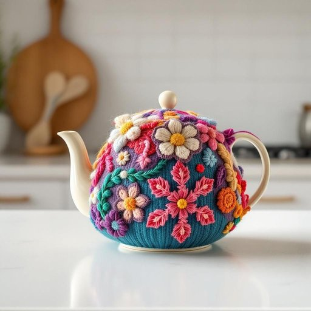

# teacosy

<h1 style="font-size: 2.5em; font-weight: 300; letter-spacing: 2px; margin: 0; color: #2c3e50;">
/teacosy*/
</h1>

---

---

## 例句

Every time I brew a fresh pot of tea in the kitchen, I meticulously place the intricately knitted teacosy, which my grandmother lovingly handcrafted with vibrant wool and delicate embroidery, snugly over the teapot to preserve the warmth for extended periods, especially during those chilly autumn afternoons when the comforting warmth is most cherished.

*Every(/ˈɛvəri/) time(/taɪm/) I(/aɪ/) brew(/bru/) a(/ə/) fresh(/frɛʃ/) pot(/pɑt/) of(/əv/) tea(/ti/) in(/ɪn/) the(/ðə/) kitchen,(/ˈkɪʧən,/) I(/aɪ/) meticulously(/məˈtɪkjələsli/) place(/pleɪs/) the(/ðə/) intricately(/ˈɪntrəkətli/) knitted(/ˈnɪtɪd/) teacosy,(/teacosy*,/) which(/wɪʧ/) my(/maɪ/) grandmother(/ˈgrændˌməðər/) lovingly(/ˈləvɪŋli/) handcrafted(/ˈhændˌkræftɪd/) with(/wɪθ/) vibrant(/ˈvaɪbrənt/) wool(/wʊl/) and(/ənd/) delicate(/ˈdɛləkət/) embroidery,(/ɛmˈbrɔɪdəri,/) snugly(/sˈnəgli/) over(/ˈoʊvər/) the(/ðə/) teapot(/ˈtiˌpɑt/) to(/tɪ/) preserve(/prɪˈzərv/) the(/ðə/) warmth(/wɔrmθ/) for(/fər/) extended(/ɪkˈstɛndɪd/) periods,(/ˈpɪriədz,/) especially(/əˈspɛʃəli/) during(/ˈdʊrɪŋ/) those(/ðoʊz/) chilly(/ˈʧɪli/) autumn(/ˈɔtəm/) afternoons(/ˌæftərˈnunz/) when(/wɪn/) the(/ðə/) comforting(/ˈkəmfərtɪŋ/) warmth(/wɔrmθ/) is(/ɪz/) most(/moʊst/) cherished.(/ˈʧɛrɪʃt./)*

**翻译：** 每当我在厨房煮上一壶新茶，便会细心地将那件由祖母用鲜艳的毛线和精致的刺绣温柔手工编织而成的茶壶罩紧紧罩在茶壶上，以延长茶的温度，尤其是在那些寒冷的秋日下午，那份温暖尤为令人珍惜。

---

## 解释

英语单词“teacosy”作为名词，在家居生活用品的语境中指的是用来套在茶壶外部，以保持茶壶中茶水温度的布套或罩子，常见于英国家庭的下午茶文化中。具体使用场合通常是在泡茶后，为防止茶水迅速变凉而套在茶壶上的织物罩，例如毛织或绒面材质，既实用又具有装饰效果。英语学习者在使用“teacosy”时需要注意，这是一个可数名词，复数形式为“teacosies”，常见搭配包括“put on a teacosy”（给茶壶套上茶壶罩）、“a knitted teacosy”（一件针织的茶壶罩）等，表达时通常与家居、茶具等词汇共同出现。词源上，“teacosy”源自19世纪末的英国，组合自“tea”（茶）和“cosy”（温暖的、舒适的），原本意指帮助物品保持温暖的罩子，体现了英国家庭注重茶文化和生活温馨的传统。在中文语境中，“teacosy”准确翻译为“茶壶套”或“茶壶罩”，指为了保温而覆盖茶壶的织物罩子，通常无褒贬含义，属于日常生活中功能性与美观兼具的家居用品，部分地区有时也称“茶壶保温套”，反映了使用时的实际作用和文化背景。

---

<small style="color: #999; font-size: 0.9em;">2025-07-27 09:14:04</small>

