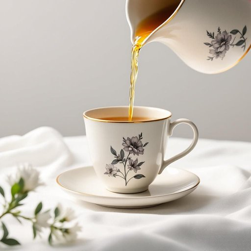

# teacup

<h1 style="font-size: 2.5em; font-weight: 300; letter-spacing: 2px; margin: 0; color: #2c3e50;">
/ˈtiˌkəp/
</h1>

---

---

## 例句

After carefully unpacking the delicate teacup, which had been passed down through generations and featured an intricate floral pattern painted by hand, she placed it gently on the saucer before pouring the freshly brewed Earl Grey tea, mindful not to spill a single drop onto the pristine tablecloth.

*After(/ˈæftər/) carefully(/ˈkɛrfəli/) unpacking(/ənˈpækɪŋ/) the(/ðə/) delicate(/ˈdɛləkət/) teacup,(/ˈtiˌkəp,/) which(/wɪʧ/) had(/hæd/) been(/bɪn/) passed(/pæst/) down(/daʊn/) through(/θru/) generations(/ˌʤɛnərˈeɪʃənz/) and(/ənd/) featured(/ˈfiʧərd/) an(/ən/) intricate(/ˈɪntrəkət/) floral(/ˈflɔrəl/) pattern(/ˈpætərn/) painted(/ˈpeɪnɪd/) by(/baɪ/) hand,(/hænd,/) she(/ʃi/) placed(/pleɪst/) it(/ɪt/) gently(/ˈʤɛntli/) on(/ɔn/) the(/ðə/) saucer(/ˈsɔsər/) before(/ˌbiˈfɔr/) pouring(/ˈpɔrɪŋ/) the(/ðə/) freshly(/ˈfrɛʃli/) brewed(/brud/) Earl(/ərl/) Grey(/greɪ/) tea,(/ti,/) mindful(/ˈmaɪndfəl/) not(/nɑt/) to(/tɪ/) spill(/spɪl/) a(/ə/) single(/ˈsɪŋgəl/) drop(/drɔp/) onto(/ˈɔntu/) the(/ðə/) pristine(/ˈprɪstin/) tablecloth.(/ˈteɪbəlˌklɔθ./)*

**翻译：** 她小心翼翼地拆开那只传承数代、饰有手绘精美花纹的精致茶杯，轻轻将其置于杯碟上，然后缓缓倒入新泡的伯爵茶，谨慎避免一滴茶水洒落在洁白如新的桌布上。

---

## 解释

英语单词“teacup”作为名词，指的是一种专门用来喝茶的小型杯子，通常由瓷器、陶瓷或玻璃制成，常见于家庭厨房或饮茶场合。它的具体使用场合多见于日常生活中的喝茶仪式、下午茶时间、家宴或咖啡厅中，常与茶壶（teapot）、茶碟（saucer）等一同出现。学习者在使用“teacup”时应注意其为可数名词，复数形式为“teacups”，且常与介词短语搭配，如“a teacup of tea”（一杯茶）、“a delicate teacup”（精致的茶杯），以及形容词如“small teacup”、“china teacup”等。此外，常见表达包括“teacup and saucer”（茶杯与茶托）以及“teacup set”（茶具套装）。词源方面，“teacup”由“tea”（茶）与“cup”（杯子）复合而成，起源于17世纪茶文化盛行后英语中对专门饮茶器具的命名，反映了茶在英国家居生活中的重要性。在中文语境中，“teacup”准确翻译为“茶杯”，强调其专用于盛茶的小杯子，区别于一般的杯子，如“水杯”或“咖啡杯”。它在文化上无褒贬色彩，但常带有英式生活优雅和细致的文化内涵，象征着一种传统而讲究的饮茶习惯，适合正式或休闲的品茶环境。总体来说，teacup不仅是日常用品的名称，更承载了一定的生活方式和文化意义。

---

<small style="color: #999; font-size: 0.9em;">2025-07-27 09:14:04</small>

