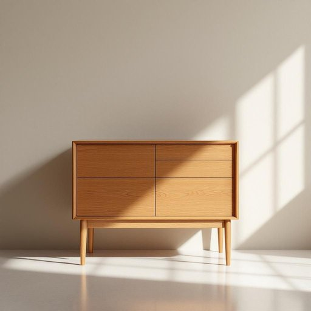

# teak

<h1 style="font-size: 2.5em; font-weight: 300; letter-spacing: 2px; margin: 0; color: #2c3e50;">
/tik/
</h1>

---

---

## 例句

The sideboard, a magnificent example of antique craftsmanship, stood proudly in the corner of the grand dining hall, its polished surface reflecting the soft glow of the chandelier while its sturdy drawers held generations of family heirlooms and delicate china.

*The(/ðə/) sideboard,(/sideboard*,/) a(/ə/) magnificent(/mægˈnɪfɪsənt/) example(/ɪgˈzæmpəl/) of(/əv/) antique(/ænˈtik/) craftsmanship,(/ˈkræftsmənˌʃɪp,/) stood(/stʊd/) proudly(/ˈpraʊdli/) in(/ɪn/) the(/ðə/) corner(/ˈkɔrnər/) of(/əv/) the(/ðə/) grand(/grænd/) dining(/ˈdaɪnɪŋ/) hall,(/hɔl,/) its(/ɪts/) polished(/ˈpɑlɪʃt/) surface(/ˈsərfəs/) reflecting(/rɪˈflɛktɪŋ/) the(/ðə/) soft(/sɔft/) glow(/gloʊ/) of(/əv/) the(/ðə/) chandelier(/ʃændəˈlɪr/) while(/waɪl/) its(/ɪts/) sturdy(/ˈstərdi/) drawers(/drɔrz/) held(/hɛld/) generations(/ˌʤɛnərˈeɪʃənz/) of(/əv/) family(/ˈfæməli/) heirlooms(/ˈɛˌrlumz/) and(/ənd/) delicate(/ˈdɛləkət/) china.(/ˈʧaɪnə./)*

**翻译：** 那座餐边柜，是古董工艺的绝佳典范，骄傲地矗立在宽敞餐厅的角落中，光滑的表面映照着吊灯柔和的光芒，而结实的抽屉则收藏着几代家族的传家宝和精致的瓷器。

---

## 解释

英语单词“teak”作为名词在家居生活用品场景中主要指的是“柚木”，这种木材因其坚硬耐用、防水防腐的特性，常用于制作高档家具、地板、船只甲板以及户外家具等。具体使用场合多见于描述家具材质或者装修材料时，如“一张柚木桌子”或“柚木地板”。英语学习者需要注意，“teak”作为不可数名词，一般不用于复数形式，且常与wood、furniture、flooring等词搭配，例如teak wood（柚木材质）和teak furniture（柚木家具），使用时语法结构较为简单，通常作为名词修饰词，不宜直接用作形容词。词源方面，“teak”一词源自马来语“teak”，通过葡萄牙语或荷兰语传入英语，反映其热带亚洲尤其是印度、缅甸等地的产地背景。中文中“teak”译为“柚木”，在家居语境下准确理解为具有高价值和优良品质的硬木材，因其色泽金黄、纹理美观而备受青睐，通常带有正面意象，代表耐用和高端生活品质，无特别褒贬色彩，文化内涵主要体现为自然材质的珍稀和家具制作的重要原料。

---

<small style="color: #999; font-size: 0.9em;">2025-07-27 09:14:04</small>

