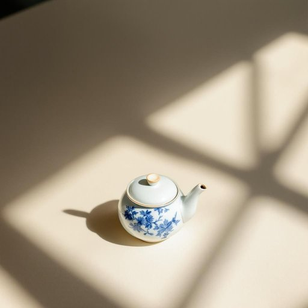

# teapot

<h1 style="font-size: 2.5em; font-weight: 300; letter-spacing: 2px; margin: 0; color: #2c3e50;">
/ˈtiˌpɑt/
</h1>

---

---

## 例句

While clearing out the old cupboard, I discovered a delicate porcelain teapot, adorned with intricate blue patterns and a tiny chip on the spout, which reminded me of the countless afternoons we spent enjoying tea together, sharing stories and laughter in the cosy warmth of the sitting room.

*While(/waɪl/) clearing(/ˈklɪrɪŋ/) out(/aʊt/) the(/ðə/) old(/oʊld/) cupboard,(/ˈkəbərd,/) I(/aɪ/) discovered(/dɪˈskəvərd/) a(/ə/) delicate(/ˈdɛləkət/) porcelain(/ˈpɔrsələn/) teapot,(/ˈtiˌpɑt,/) adorned(/əˈdɔrnd/) with(/wɪθ/) intricate(/ˈɪntrəkət/) blue(/blu/) patterns(/ˈpætərnz/) and(/ənd/) a(/ə/) tiny(/ˈtaɪni/) chip(/ʧɪp/) on(/ɔn/) the(/ðə/) spout,(/spaʊt,/) which(/wɪʧ/) reminded(/riˈmaɪndɪd/) me(/mi/) of(/əv/) the(/ðə/) countless(/ˈkaʊntləs/) afternoons(/ˌæftərˈnunz/) we(/wi/) spent(/spɛnt/) enjoying(/ˌɛnˈʤɔɪɪŋ/) tea(/ti/) together,(/təˈgɛðər,/) sharing(/ˈʃɛrɪŋ/) stories(/ˈstɔriz/) and(/ənd/) laughter(/ˈlæftər/) in(/ɪn/) the(/ðə/) cosy(/ˈkoʊzi/) warmth(/wɔrmθ/) of(/əv/) the(/ðə/) sitting(/ˈsɪtɪŋ/) room.(/rum./)*

**翻译：** 在清理旧橱柜时，我发现了一只精致的瓷壶，壶身装饰着复杂的蓝色花纹，壶嘴上有一处细小的缺口，它让我想起那些无数个下午，我们一起品茶，分享故事与欢笑，沉浸在起居室温馨的氛围中。

---

## 解释

“teapot”作为名词，指的是一种用于泡茶和盛茶的壶，常见于家居生活用品中，尤指日常生活、茶会或下午茶等场合。在使用时，英语学习者需注意其单复数形式（单数为teapot，复数为teapots），并常与动词如“fill”（装满）、“pour”（倒茶）、“clean”（清洗）连用，常见搭配还有“a ceramic teapot”（瓷质茶壶）、“a silver teapot”（银质茶壶）等，表达时可结合“make tea”（泡茶）等短语增强语义。词源上，teapot由“tea”（茶）和“pot”（壶）合成，起源于17世纪英国茶文化兴起时期，用以描述专门用于泡茶的容器，体现了英国人的饮茶习惯。中文语境中，“teapot”准确翻译为“茶壶”，涵义明确，通常不含褒贬意味，但在某些文化表达中，茶壶可能象征温馨、好客或者品味生活，偶尔也会作为比喻或俚语出现。总体而言，“teapot”是一个具体且常用的家居生活名词，学习者把握其基本用法和搭配即可，文化内涵则以实用和礼仪为主，无明显特殊色彩。

---

<small style="color: #999; font-size: 0.9em;">2025-07-27 09:14:04</small>

