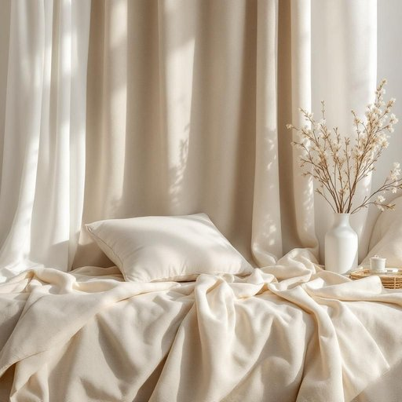

# textile

<h1 style="font-size: 2.5em; font-weight: 300; letter-spacing: 2px; margin: 0; color: #2c3e50;">
/ˈtɛkˌstaɪl/
</h1>

---

---

## 例句

When the textile industry faces unprecedented challenges due to global supply chain disruptions, innovative strategies that integrate sustainable practices with advanced manufacturing technologies become essential to preserve the cultural heritage and economic vitality associated with traditional textile craftsmanship.

*When(/wɪn/) the(/ðə/) textile(/ˈtɛkˌstaɪl/) industry(/ˈɪndəstri/) faces(/ˈfeɪsɪz/) unprecedented(/ənˈprɛsɪˌdɛntɪd/) challenges(/ˈʧælənʤɪz/) due(/du/) to(/tɪ/) global(/ˈgloʊbəl/) supply(/səˈplaɪ/) chain(/ʧeɪn/) disruptions,(/dɪsˈrəpʃənz,/) innovative(/ˈɪnəˌveɪtɪv/) strategies(/ˈstrætəʤiz/) that(/ðət/) integrate(/ˈɪnəˌgreɪt/) sustainable(/səˈsteɪnəbəl/) practices(/ˈpræktɪsɪz/) with(/wɪθ/) advanced(/ədˈvænst/) manufacturing(/ˌmænjəˈfækʧərɪŋ/) technologies(/tɛkˈnɑləʤiz/) become(/bɪˈkəm/) essential(/ɛˈsɛnʃəl/) to(/tɪ/) preserve(/prɪˈzərv/) the(/ðə/) cultural(/ˈkəlʧərəl/) heritage(/ˈhɛrɪtɪʤ/) and(/ənd/) economic(/ˌɛkəˈnɑmɪk/) vitality(/vaɪˈtæləti/) associated(/əˈsoʊʃiˌeɪtəd/) with(/wɪθ/) traditional(/trəˈdɪʃənəl/) textile(/ˈtɛkˌstaɪl/) craftsmanship.(/ˈkræftsmənˌʃɪp./)*

**翻译：** 当纺织业因全球供应链中断面临前所未有的挑战时，结合可持续实践与先进制造技术的创新策略，成为保护传统纺织工艺所承载的文化遗产与经济活力的关键。

---

## 解释

英语单词“textile”作为名词在家居生活用品的语境中，通常指用于制作布料、床上用品、窗帘、沙发布套等各种纺织品材料，使用场合多见于家具装饰、窗帘布料选择、室内设计描述以及家纺产品的购买和介绍等。英语学习者在使用“textile”时需注意其词性为可数名词，复数形式为“textiles”，且常与形容词连用，如“cotton textile”（棉质纺织品）、“synthetic textile”（合成纺织品），或与表示用途的词搭配，如“home textiles”（家用纺织品）。此外，“textile industry”指纺织工业，表达上常通过具体的材质或用途来限定其范围。“textile”源自拉丁语“textilis”，意为“织成的”，根基在于“texere”（编织），反映其作为纺织物的本质属性。在中文语境中，“textile”准确翻译为“纺织品”，尤其指家居领域时可译为“家用纺织品”或“纺织物”，既涵盖布料本身也指其制成品。该词本身无褒贬色彩，属于中性词，主要用于专业或生活常用表达中，强调材料和工艺属性，无特殊文化内涵或情感负载。整体而言，“textile”强调的是纺织材料及其在家居生活中多样化的应用，适合在描述家居舒适性、装饰风格或功能性时使用。

---

<small style="color: #999; font-size: 0.9em;">2025-07-27 09:14:04</small>

