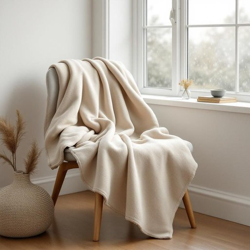

# throw

<h1 style="font-size: 2.5em; font-weight: 300; letter-spacing: 2px; margin: 0; color: #2c3e50;">
/θroʊ/
</h1>

---

---

## 例句

Although the forecast predicted heavy rain throughout the afternoon, I stayed cozy in my favorite chair, wrapped in the fleece throw I had purchased last winter, as the gentle tapping of raindrops against the windowpane created a soothing backdrop for my tea and novel.

*Although(/ˌɔlˈðoʊ/) the(/ðə/) forecast(/ˈfɔrˌkæst/) predicted(/prɪˈdɪktɪd/) heavy(/ˈhɛvi/) rain(/reɪn/) throughout(/θruaʊt/) the(/ðə/) afternoon,(/ˌæftərˈnun,/) I(/aɪ/) stayed(/steɪd/) cozy(/ˈkoʊzi/) in(/ɪn/) my(/maɪ/) favorite(/ˈfeɪvərɪt/) chair,(/ʧɛr,/) wrapped(/ræpt/) in(/ɪn/) the(/ðə/) fleece(/flis/) throw(/θroʊ/) I(/aɪ/) had(/hæd/) purchased(/ˈpərʧəst/) last(/læst/) winter,(/ˈwɪntər,/) as(/ɛz/) the(/ðə/) gentle(/ˈʤɛnəl/) tapping(/ˈtæpɪŋ/) of(/əv/) raindrops(/ˈreɪnˌdrɑps/) against(/əˈgɛnst/) the(/ðə/) windowpane(/ˈwɪndoʊˌpeɪn/) created(/kriˈeɪtɪd/) a(/ə/) soothing(/ˈsuðɪŋ/) backdrop(/ˈbækˌdrɑp/) for(/fər/) my(/maɪ/) tea(/ti/) and(/ənd/) novel.(/ˈnɑvəl./)*

**翻译：** 虽然天气预报预测整个下午都会下大雨，我却安坐在最喜欢的椅子上，裹着去年冬天买的羊绒毯，窗外雨滴轻轻敲打着玻璃，伴随着茶香和书页翻动的声音，营造出一片宁静祥和的氛围。

---

## 解释

在家居生活用品的语境中，英语单词"throw"作为名词主要指的是一种装饰性或实用性的毯子，通常是轻便的、用于搭配沙发、床铺等，既能增添温暖又具有装饰作用。这种用法常见于家具陈设、室内设计及家居用品销售中，比如“a throw blanket”意指“毯子”或“披毯”。英语学习者在使用"throw"作为名词时需注意，它与动词"throw"（扔、投掷）含义不同，且在此语境下通常与"blanket"连用，单独使用时可能不被理解，因此常见搭配为“throw blanket”或简称“throw”；此外，作为名词时需用冠词修饰，如“a throw”。词源方面，"throw"来源于古英语"thrāwan"，本意为“投掷”，而此处的名词用法则是因毯子可以方便地“投掷”或“披盖”在家具上而得名，体现功能转义。在中文语境中，“throw”作为家居用品名词时应翻译为“披毯”、“装饰毯”或“沙发毯”，强调其方便覆盖和装饰的功能，避免与动词“扔”混淆。该词在家居用品领域没有褒贬色彩，属于中性词，文化内涵主要体现为舒适、温馨和装饰美学，适用于家庭生活的日常环境。

---

<small style="color: #999; font-size: 0.9em;">2025-07-27 09:14:04</small>

