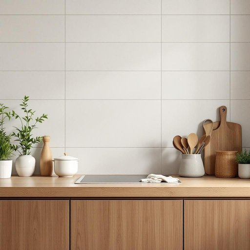

# tile

<h1 style="font-size: 2.5em; font-weight: 300; letter-spacing: 2px; margin: 0; color: #2c3e50;">
/taɪl/
</h1>

---

---

## 例句

Before we decide on the colour scheme for the kitchen walls, we should carefully consider whether the glazed ceramic tile, which not only provides durability but also adds a subtle sheen that catches the light beautifully, would complement the oak countertops and stainless steel appliances we plan to install.

*Before(/ˌbiˈfɔr/) we(/wi/) decide(/ˌdɪˈsaɪd/) on(/ɔn/) the(/ðə/) colour(/ˈkələr/) scheme(/skim/) for(/fər/) the(/ðə/) kitchen(/ˈkɪʧən/) walls,(/wɔlz,/) we(/wi/) should(/ʃʊd/) carefully(/ˈkɛrfəli/) consider(/kənˈsɪdər/) whether(/ˈwɛðər/) the(/ðə/) glazed(/gleɪzd/) ceramic(/sərˈæmɪk/) tile,(/taɪl,/) which(/wɪʧ/) not(/nɑt/) only(/ˈoʊnli/) provides(/prəˈvaɪdz/) durability(/dərəˈbɪlɪti/) but(/bət/) also(/ˈɔlsoʊ/) adds(/ædz/) a(/ə/) subtle(/ˈsətəl/) sheen(/ʃin/) that(/ðət/) catches(/ˈkæʧɪz/) the(/ðə/) light(/laɪt/) beautifully,(/ˈbjutəfli,/) would(/wʊd/) complement(/ˈkɑmpləmənt/) the(/ðə/) oak(/oʊk/) countertops(/ˈkaʊntərˌtɑps/) and(/ənd/) stainless(/ˈsteɪnləs/) steel(/stil/) appliances(/əˈplaɪənsɪz/) we(/wi/) plan(/plæn/) to(/tɪ/) install.(/ˌɪnˈstɔl./)*

**翻译：** 在确定厨房墙面颜色方案之前，我们应仔细考虑釉面陶瓷砖是否与拟安装的橡木台面和不锈钢电器相得益彰。釉面陶瓷砖不仅坚固耐用，还带有细腻的光泽，能够优雅地映射光线。

---

## 解释

英语单词“tile”作为名词在家居生活用品的语境中，通常指铺设在地面、墙面或屋顶上的小块薄板，材质多样，包括陶瓷、瓷砖、石材、玻璃或金属等，主要用于装饰和保护表面，常见于厨房、浴室、客厅地面及屋顶瓦片。具体使用场合多见于讨论房屋装修、建筑材料或室内设计时，如“ceramic wall tiles”（陶瓷墙砖）、“floor tiles”（地砖）等。英语学习者需注意“tile”作为可数名词，复数形式为“tiles”，其搭配常见有形容材料（ceramic tile、marble tile）、用途（roof tile、floor tile）及描述特征（decorative tile、glazed tile），此外，“lay tiles”表示“铺设瓷砖”，是常用表达。词源上，“tile”来源于古法语“tile”，再源于拉丁语“tegula”，意为覆盖物，与“roof”相关联，反映其传统应用于屋顶覆盖的历史背景。在中文语境中，tile通常被准确翻译为“瓷砖”或“瓦片”，具体需结合材质和用途区分，如“地砖”、“墙砖”或“瓦片”等，表达上较为中性，无褒贬色彩，纯粹描述功能性与材质属性，文化内涵较为普通，属于日常生活中常见的建筑材料名词。

---

<small style="color: #999; font-size: 0.9em;">2025-07-27 09:14:04</small>

