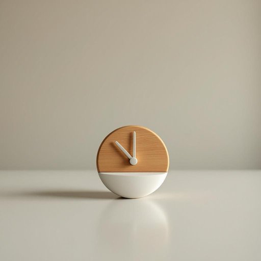

# timer

<h1 style="font-size: 2.5em; font-weight: 300; letter-spacing: 2px; margin: 0; color: #2c3e50;">
/ˈtaɪmər/
</h1>

---

---

## 例句

Could you please check if the timer on the oven has been set correctly, since it not only controls the cooking duration but also ensures that the roast won't burn while we're busy preparing the rest of the dinner?

*Could(/kʊd/) you(/ju/) please(/pliz/) check(/ʧɛk/) if(/ɪf/) the(/ðə/) timer(/ˈtaɪmər/) on(/ɔn/) the(/ðə/) oven(/ˈəvən/) has(/həz/) been(/bɪn/) set(/sɛt/) correctly,(/kərˈɛktli,/) since(/sɪns/) it(/ɪt/) not(/nɑt/) only(/ˈoʊnli/) controls(/kənˈtroʊlz/) the(/ðə/) cooking(/ˈkʊkɪŋ/) duration(/ˈdʊˈreɪʃən/) but(/bət/) also(/ˈɔlsoʊ/) ensures(/ɪnˈʃʊrz/) that(/ðət/) the(/ðə/) roast(/roʊst/) won't(/woʊnt/) burn(/bərn/) while(/waɪl/) we're(/wɪr/) busy(/ˈbɪzi/) preparing(/pərˈpɛrɪŋ/) the(/ðə/) rest(/rɛst/) of(/əv/) the(/ðə/) dinner?(/ˈdɪnər?/)*

**翻译：** 请您确认一下烤箱的定时器是否设置正确，因为它不仅控制烹饪时间，还能确保烤肉在我们忙着准备晚餐其他部分时不会烧焦。

---

## 解释

英语单词“timer”作为名词，在家居生活用品场景中通常指用来计时或设定时间的装置，常见于厨房定时器、电器延时开关或计时器功能的设备，如微波炉、烤箱、洗衣机等，用以控制工作的持续时间或启动时间。英语学习者使用“timer”时应注意其名词用法，多与动词“set”（设定）、“use”（使用）、“activate”（启动）等搭配，如“set the timer”（设定定时器）、“use the timer to cook”（用定时器烹饪），此外，还可与介词短语“on the timer”结合表示“在定时器上”。语法上，“timer”为可数名词，需根据数量使用单数或复数形式，并可用作复合词的一部分如“timer switch”（定时开关）。词源方面，“timer”来源于动词“time”，加上名词后缀“-er”，表示“进行计时的人或物”，源自中古英语和拉丁语时间词根，反映其计量时间的功能。在中文语境中，“timer”通常准确翻译为“定时器”或“计时器”，强调其通过预设时间实现自动控制的功能，兼有实用性和便利性的含义。此词中性无褒贬色彩或特殊文化内涵，主要侧重技术设备属性，适用于日常生活中描述时间控制的家用电器或工具。

---

<small style="color: #999; font-size: 0.9em;">2025-07-27 09:14:04</small>

