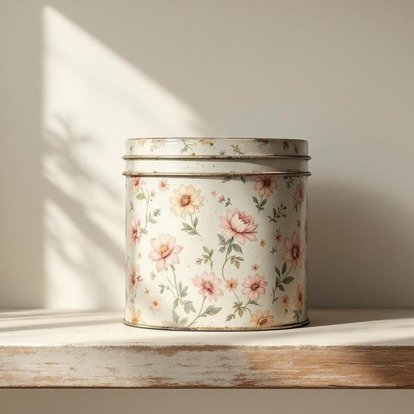

# tin

<h1 style="font-size: 2.5em; font-weight: 300; letter-spacing: 2px; margin: 0; color: #2c3e50;">
/tɪn/
</h1>

---

---

## 例句

Could you please pass me that tin of biscuits from the top shelf in the kitchen cupboard, the one with the faded floral pattern that’s been sitting untouched since last Christmas, because I’m craving something sweet to go with my tea?

*Could(/kʊd/) you(/ju/) please(/pliz/) pass(/pæs/) me(/mi/) that(/ðət/) tin(/tɪn/) of(/əv/) biscuits(/ˈbɪskəts/) from(/frəm/) the(/ðə/) top(/tɔp/) shelf(/ʃɛlf/) in(/ɪn/) the(/ðə/) kitchen(/ˈkɪʧən/) cupboard,(/ˈkəbərd,/) the(/ðə/) one(/wən/) with(/wɪθ/) the(/ðə/) faded(/ˈfeɪdɪd/) floral(/ˈflɔrəl/) pattern(/ˈpætərn/) that’s(/that’s*/) been(/bɪn/) sitting(/ˈsɪtɪŋ/) untouched(/ənˈtəʧt/) since(/sɪns/) last(/læst/) Christmas,(/ˈkrɪsməs,/) because(/bɪˈkəz/) I’m(/i’m*/) craving(/ˈkreɪvɪŋ/) something(/ˈsəmθɪŋ/) sweet(/swit/) to(/tɪ/) go(/goʊ/) with(/wɪθ/) my(/maɪ/) tea?(/ti?/)*

**翻译：** 您能帮我拿一下厨房橱柜顶层那个饼干铁盒吗？就是那个印着褪色花纹、从去年圣诞节以来一直没动过的，因为我正想配茶吃点甜的东西。

---

## 解释

英语单词“tin”作为名词在家居生活用品场景中，通常指一种金属容器，常用于储存食品、糖果、饼干、茶叶等日常用品，其材质多为锡或锡镀层的铁皮，这种容器既能保护内容物避免潮湿和空气侵入，又便于密封保存。具体使用场合多见于厨房、储藏室或者家庭消费产品包装中，如“一罐饼干”、 “一罐茶叶”。英语学习者在使用“tin”时需注意其作为可数名词时通常指单个容器，而不可数形式多指锡这种金属本身，且常用的搭配包括“tin can”（铁罐）、“tin box”（锡盒）、“a tin of...”加具体物品名。此外，“tin”在不同地区的英语中可能存在用法差异，比如在英式英语中“tin”较常指食品罐，而美式英语中更习惯用“can”。词源上，“tin”源于古英语“tin”，意为锡，这种金属因其耐腐蚀性被广泛用于制造容器。中文语境中，“tin”准确翻译通常为“锡盒”或“锡罐”，在某些情况下也直接译为“金属罐”或“铁罐”，具体根据材质和用途来区分。值得注意的是，词汇本身无特别褒贬色彩，但与之相关的表达有时可引申为便宜、简单的容器，表达上较为中性。整体来看，“tin”在家居用品中是一种常见且实用的物品，其使用涉及对容器功能和材质的理解，对于学习者掌握其常见搭配和美英差异尤为重要。

---

<small style="color: #999; font-size: 0.9em;">2025-07-27 09:14:04</small>

