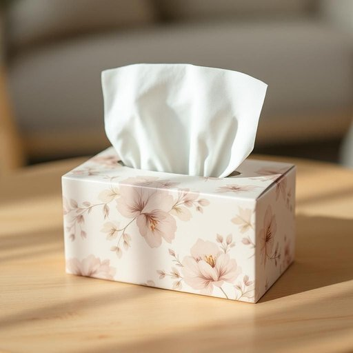

# tissue

<h1 style="font-size: 2.5em; font-weight: 300; letter-spacing: 2px; margin: 0; color: #2c3e50;">
/ˈtɪʃu/
</h1>

---

---

## 例句

The tissue you asked for, which features the floral pattern Mum purchased last week, is on the coffee table and perfect for blotting the tea stain on your shirt.

*The(/ðə/) tissue(/ˈtɪʃu/) you(/ju/) asked(/æst/) for,(/fər,/) which(/wɪʧ/) features(/ˈfiʧərz/) the(/ðə/) floral(/ˈflɔrəl/) pattern(/ˈpætərn/) Mum(/məm/) purchased(/ˈpərʧəst/) last(/læst/) week,(/wik,/) is(/ɪz/) on(/ɔn/) the(/ðə/) coffee(/ˈkɔfi/) table(/ˈteɪbəl/) and(/ənd/) perfect(/ˈpərˌfɪkt/) for(/fər/) blotting(/ˈblɑtɪŋ/) the(/ðə/) tea(/ti/) stain(/steɪn/) on(/ɔn/) your(/jʊr/) shirt.(/ʃərt./)*

**翻译：** 你要的那块面巾纸，上面印有上周妈妈买的花卉图案，就放在茶几上，非常适合用来吸干你衬衫上的茶渍。

---

## 解释

单词“tissue”作为名词在家居生活用品的语境中通常指的是“纸巾”或“面巾纸”，一般用于擦拭鼻涕、擦脸或清洁日常小污渍等场合，是家庭中常见的一次性生活用品。英语学习者在使用“tissue”时需注意它通常以不可数名词形式出现，但在指多张纸巾时也可作可数名词，常见搭配有“facial tissue”（面巾纸）、“box of tissues”（一盒纸巾）、“soft tissue”等表达；另外，“tissue paper”则多指薄透的装饰纸，与生活用纸巾有所区别。词源上，“tissue”源自中古法语“tissu”，意为织物或纺织品，进一步源自拉丁语“texere”意为“编织”，这反映了“tissue”一词最初与织物相关，后来引申为类似质地娇软细腻的纸制品。在中文语境中，“tissue”通常翻译为“纸巾”或“面巾纸”，不宜混淆为医用“组织”（如生物学中的“组织”亦称tissue），在日常生活中使用时通常无褒贬色彩，但要注意文化上对纸巾的使用礼仪，如公共场所适度使用，不滥用。整体而言，“tissue”在家庭生活用品领域是一个实用且频繁出现的词汇，理解其具体语境和语法搭配对英语学习者尤为重要。

---

<small style="color: #999; font-size: 0.9em;">2025-07-27 09:14:04</small>

