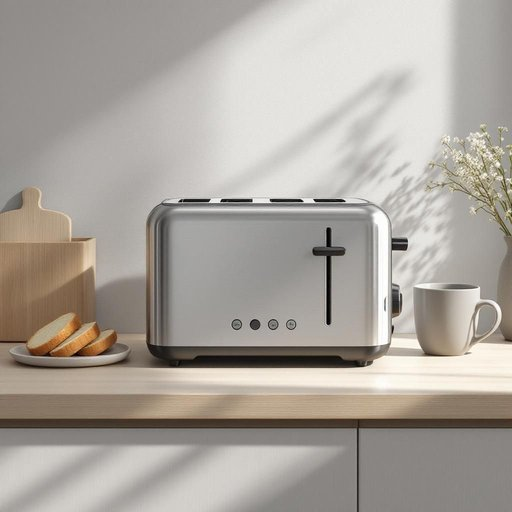

# toaster

<h1 style="font-size: 2.5em; font-weight: 300; letter-spacing: 2px; margin: 0; color: #2c3e50;">
/ˈtoʊstər/
</h1>

---

---

## 例句

After carefully unpacking the brand-new toaster, which boasts multiple browning settings and a sleek stainless steel finish, she placed the toaster on the kitchen counter next to the bread bin and coffee machine, eager to finally enjoy perfectly toasted slices of sourdough every morning without the usual uneven heating that the old appliance used to cause.

*After(/ˈæftər/) carefully(/ˈkɛrfəli/) unpacking(/ənˈpækɪŋ/) the(/ðə/) brand-new(/ˈbrændˌnu/) toaster,(/ˈtoʊstər,/) which(/wɪʧ/) boasts(/boʊsts/) multiple(/ˈməltəpəl/) browning(/ˈbraʊnɪŋ/) settings(/ˈsɛtɪŋz/) and(/ənd/) a(/ə/) sleek(/slik/) stainless(/ˈsteɪnləs/) steel(/stil/) finish,(/ˈfɪnɪʃ,/) she(/ʃi/) placed(/pleɪst/) the(/ðə/) toaster(/ˈtoʊstər/) on(/ɔn/) the(/ðə/) kitchen(/ˈkɪʧən/) counter(/ˈkaʊntər/) next(/nɛkst/) to(/tɪ/) the(/ðə/) bread(/brɛd/) bin(/bɪn/) and(/ənd/) coffee(/ˈkɔfi/) machine,(/məˈʃin,/) eager(/ˈigər/) to(/tɪ/) finally(/ˈfaɪnəli/) enjoy(/ˌɛnˈʤɔɪ/) perfectly(/ˈpərfəktli/) toasted(/ˈtoʊstɪd/) slices(/sˈlaɪsɪz/) of(/əv/) sourdough(/sourdough*/) every(/ˈɛvəri/) morning(/ˈmɔrnɪŋ/) without(/wɪˈθaʊt/) the(/ðə/) usual(/ˈjuʒəwəl/) uneven(/əˈnivən/) heating(/ˈhitɪŋ/) that(/ðət/) the(/ðə/) old(/oʊld/) appliance(/əˈplaɪəns/) used(/juzd/) to(/tɪ/) cause.(/kɔz./)*

**翻译：** 她小心翼翼地拆开全新的烤面包机，这台机器拥有多档烘烤设置和光滑的不锈钢外观。她将烤面包机放在厨房台面上，紧挨着面包箱和咖啡机，迫不及待地希望每天早晨都能享用完美烤制的酸面包片，而不用再忍受旧设备常常导致的不均匀加热。

---

## 解释

英语单词“toaster”作为家居生活用品中的名词，指的是一种用于烤制面包片的厨房小电器，通常通过电热元件将面包快速加热、烘烤成金黄色且口感酥脆，常见于早餐时使用。具体使用场合多为家庭厨房或餐厅，尤其是在需要快速制作吐司面包时。英语学习者在使用“toaster”时应注意其作为可数名词出现时需加冠词（如a toaster），并且常见搭配包括“electric toaster”（电动烤面包机）、“pop-up toaster”（弹出式烤面包机）、“toaster oven”（多功能烤箱，兼具烤面包功能）等；表达时可用短语如“make toast with a toaster”表示“用烤面包机做吐司”。词源方面，“toaster”来自英语动词“toast”，意为“烤面包”，加上表示器具的后缀“-er”，最初出现于19世纪末，随着电气技术发展，toaster作为家用电器得到普及，成为现代厨房的典型设备。在中文语境中，“toaster”准确翻译为“烤面包机”，强调其专用于烘烤面包的功能，避免与“烤箱”混淆。该词无明显褒贬色彩，属于中性词汇，但在不同文化背景下，人们对早餐或烤面包机的依赖程度可能影响使用频率和熟悉度，总体上“toaster”代表方便、快捷的生活方式工具。

---

<small style="color: #999; font-size: 0.9em;">2025-07-27 09:14:04</small>

