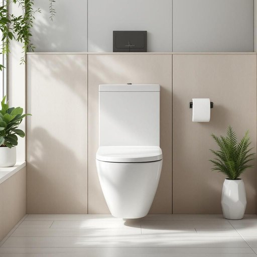

# toilet

<h1 style="font-size: 2.5em; font-weight: 300; letter-spacing: 2px; margin: 0; color: #2c3e50;">
/ˈtɔɪlət/
</h1>

---

---

## 例句

Could you please check if the toilet in the guest bathroom, which has been leaking slightly for the past week despite our attempts to fix it, needs a plumber to come by before our guests arrive this weekend?

*Could(/kʊd/) you(/ju/) please(/pliz/) check(/ʧɛk/) if(/ɪf/) the(/ðə/) toilet(/ˈtɔɪlət/) in(/ɪn/) the(/ðə/) guest(/gɛst/) bathroom,(/ˈbæθˌrum,/) which(/wɪʧ/) has(/həz/) been(/bɪn/) leaking(/ˈlikɪŋ/) slightly(/sˈlaɪtli/) for(/fər/) the(/ðə/) past(/pæst/) week(/wik/) despite(/dɪˈspaɪt/) our(/ɑr/) attempts(/əˈtɛmpts/) to(/tɪ/) fix(/fɪks/) it,(/ɪt,/) needs(/nidz/) a(/ə/) plumber(/ˈpləmər/) to(/tɪ/) come(/kəm/) by(/baɪ/) before(/ˌbiˈfɔr/) our(/ɑr/) guests(/gɛsts/) arrive(/əraɪv/) this(/ðɪs/) weekend?(/ˈwiˌkɪnd?/)*

**翻译：** 请您帮忙确认一下，客用卫生间的马桶在过去一周内虽经我们努力修理仍有轻微渗漏，是否需要请水管工在本周末客人到来前过来检查？

---

## 解释

英语单词“toilet”作为名词在家居生活用品的语境中，主要指的是卫生间中用于排泄的装置，即“马桶”或“坐便器”，有时泛指卫生间整体（但更正式的用法是指具体设备）。具体使用场合多见于描述房间内部设施或日常生活环境，比如“The toilet is clogged”意为“马桶堵了”，或“Please use the toilet before we leave”指“请在我们出门前使用厕所”。英语学习者需注意，“toilet”作为名词的复数形式是“toilets”，且在英式英语中“toilet”既可以指厕所的房间，也指装置，而美式英语中更多用“bathroom”或“restroom”来表示厕所空间，而“toilet”主要指装置。此外，常见搭配包括“flush the toilet”（冲马桶）、“toilet seat”（马桶盖）、“public toilet”（公共厕所）等，表达时要注意其具体指代以免引起歧义。词源方面，“toilet”源自法语“toilette”，本意是指“梳洗”，后来引申为梳洗所用的设备和场所，逐渐在英语中演变为指代厕所设备。中文语境中，“toilet”常翻译为“马桶”或“厕所”，但应根据上下文判断，避免将其简单等同于“厕所”这一空间概念，因英语中有更专门的词汇用于描述空间本身。在文化内涵上，虽然“toilet”是一个中性词，但在某些场合被视为较为直接或略显粗俗的表达，特别是在正式或礼貌语境中，英美人士更倾向使用“restroom”“bathroom”等词汇，因此英语学习者应根据语境调整用词，以体现礼貌和得体。

---

<small style="color: #999; font-size: 0.9em;">2025-07-27 09:14:04</small>

