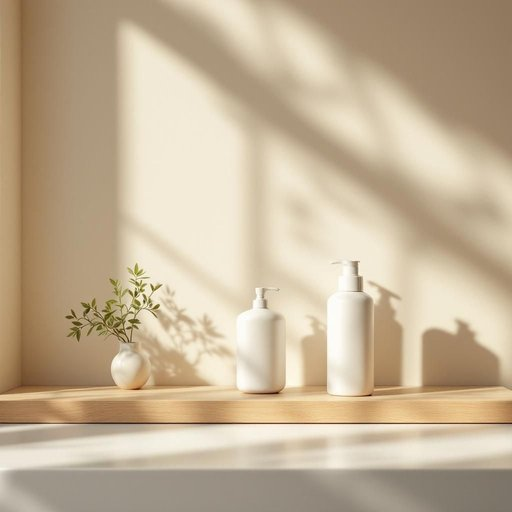

# toiletry

<h1 style="font-size: 2.5em; font-weight: 300; letter-spacing: 2px; margin: 0; color: #2c3e50;">
/ˈtɔɪlətri/
</h1>

---

---

## 例句

Before you head out, make sure to pack all the essential toiletry items, such as your toothbrush, shampoo, and shaving cream, which are not only crucial for maintaining personal hygiene but also help you feel comfortable and refreshed throughout your trip.

*Before(/ˌbiˈfɔr/) you(/ju/) head(/hɛd/) out,(/aʊt,/) make(/meɪk/) sure(/ʃʊr/) to(/tɪ/) pack(/pæk/) all(/ɔl/) the(/ðə/) essential(/ɛˈsɛnʃəl/) toiletry(/ˈtɔɪlətri/) items,(/ˈaɪtəmz,/) such(/səʧ/) as(/ɛz/) your(/jʊr/) toothbrush,(/ˈtuθbrəʃ,/) shampoo,(/ʃæmˈpu,/) and(/ənd/) shaving(/ˈʃeɪvɪŋ/) cream,(/krim,/) which(/wɪʧ/) are(/ər/) not(/nɑt/) only(/ˈoʊnli/) crucial(/ˈkruʃəl/) for(/fər/) maintaining(/meɪnˈteɪnɪŋ/) personal(/ˈpərsɪnəl/) hygiene(/ˈhaɪˌʤin/) but(/bət/) also(/ˈɔlsoʊ/) help(/hɛlp/) you(/ju/) feel(/fil/) comfortable(/ˈkəmfərtəbəl/) and(/ənd/) refreshed(/riˈfrɛʃt/) throughout(/θruaʊt/) your(/jʊr/) trip.(/trɪp./)*

**翻译：** 在出发前，请务必将所有必备的洗漱用品打包妥当，如牙刷、洗发水和剃须膏，这些不仅对保持个人卫生至关重要，也能让您在旅途中感到舒适与清爽。

---

## 解释

英语单词“toiletry”作为名词，主要指个人洗漱和美容用的日常用品，如牙膏、香皂、洗发水、剃须刀等，常见于家居生活用品的语境中，多用于旅行打包、浴室收纳或个人护理场合。英语学习者需注意，toiletry本身通常是不可数名词，复数形式常见为toiletries，表示一组洗漱用品，常用搭配有“toiletry bag”（洗漱包）、“toiletry kit”等，表达时要区分单复数和可数不可数的用法。词源方面，toiletry源自法语toilette，最初指整理仪容的过程，后来引申为相关的化妆和清洁用品。中文语境中，toiletry通常翻译为“洗漱用品”或“个人护理用品”，强调日常清洁、梳洗所用的物品，准确理解便是指那些保持个人卫生和外貌整洁的必备用品。该词没有特殊褒贬含义，属于中性词汇，主要反映日常生活中的实用物品，文化内涵与现代生活的个人卫生习惯密切相关。

---

<small style="color: #999; font-size: 0.9em;">2025-07-27 09:14:04</small>

