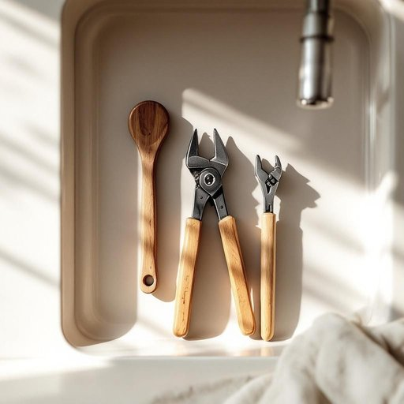

# tool

<h1 style="font-size: 2.5em; font-weight: 300; letter-spacing: 2px; margin: 0; color: #2c3e50;">
/tul/
</h1>

---

---

## 例句

If you’re planning to fix the leaky tap in the kitchen yourself, you’ll need the right tool, such as a wrench that fits the tight spaces under the sink and a pair of pliers, both of which are essential for tackling plumbing issues without having to call a professional.

*If(/ɪf/) you’re(/you’re*/) planning(/ˈplænɪŋ/) to(/tɪ/) fix(/fɪks/) the(/ðə/) leaky(/ˈliki/) tap(/tæp/) in(/ɪn/) the(/ðə/) kitchen(/ˈkɪʧən/) yourself,(/ˈjɔrsɛlf,/) you’ll(/you’ll*/) need(/nid/) the(/ðə/) right(/raɪt/) tool,(/tul,/) such(/səʧ/) as(/ɛz/) a(/ə/) wrench(/rɛnʧ/) that(/ðət/) fits(/fɪts/) the(/ðə/) tight(/taɪt/) spaces(/ˈspeɪsɪz/) under(/ˈəndər/) the(/ðə/) sink(/sɪŋk/) and(/ənd/) a(/ə/) pair(/pɛr/) of(/əv/) pliers,(/plaɪərz,/) both(/boʊθ/) of(/əv/) which(/wɪʧ/) are(/ər/) essential(/ɛˈsɛnʃəl/) for(/fər/) tackling(/ˈtækəlɪŋ/) plumbing(/ˈpləmɪŋ/) issues(/ˈɪʃuz/) without(/wɪˈθaʊt/) having(/ˈhævɪŋ/) to(/tɪ/) call(/kɔl/) a(/ə/) professional.(/prəˈfɛʃənəl./)*

**翻译：** 如果你打算自己修理厨房里漏水的水龙头，就需要准备合适的工具，比如能够深入水槽下狭窄空间的扳手和一把钳子，这两样工具对于解决管道问题至关重要，能帮助你避免请专业人员上门。

---

## 解释

英语单词“tool”在家居生活用品场景中作为名词，通常指用于修理、制作或维护家庭物品的各种手工器具，如锤子、螺丝刀、扳手等，这些工具多用于具体操作，如安装家具、修理家电或园艺劳动，语境一般涉及动手劳动和实用技能。英语学习者在使用“tool”时需注意其可数性，通常用复数形式“tools”表示多种工具，且常与动词“use”、“have”、“need”搭配，如“use a tool”（使用工具）、“a set of tools”（一套工具）。此外，固定搭配如“tool box”（工具箱）、“power tools”（电动工具）也较为常见。在表达技巧上，区分“tool”作为具体器具与比喻义（如“a tool of change”意指“变革的工具”）有助于避免语义混淆。词源方面，“tool”源自古英语“tōl”，意指方便使用的器械，其根源可追溯到日耳曼语族，反映了人类早期制造和使用器物的历史。中文语境中，“tool”准确译为“工具”，侧重实用性和功能性，指家居环境中帮助完成各类维修和DIY任务的器具，通常无褒贬色彩，属于中性词汇，文化上体现了勤劳和自助精神，但在口语或文学中偶尔可能带有贬义，如称某人是“a tool”意为被人操纵的傀儡，因此学习时需结合具体语境理解。

---

<small style="color: #999; font-size: 0.9em;">2025-07-27 09:14:04</small>

