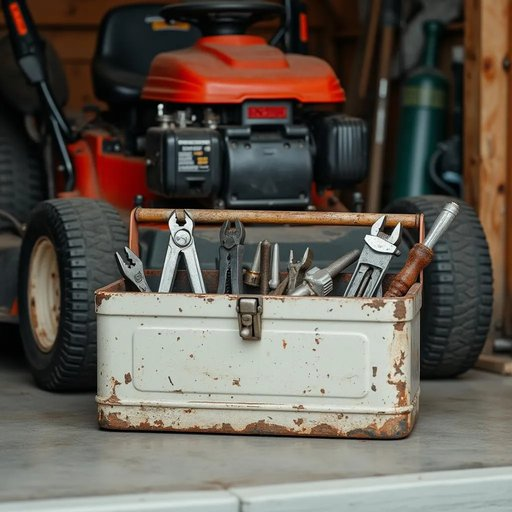

# toolbox

<h1 style="font-size: 2.5em; font-weight: 300; letter-spacing: 2px; margin: 0; color: #2c3e50;">
/ˈtulˌbɔks/
</h1>

---

---

## 例句

After searching through the cluttered garage for nearly an hour, I finally found the old, battered toolbox tucked away behind the lawnmower, which contained not only the usual assortment of screwdrivers and pliers but also a few specialty wrenches and spare nails that my grandfather had carefully organized and handed down to me, ensuring I had everything needed for fixing the creaky door hinges and squeaky cabinet drawers around the house.

*After(/ˈæftər/) searching(/ˈsərʧɪŋ/) through(/θru/) the(/ðə/) cluttered(/ˈklətərd/) garage(/gərɑʒ/) for(/fər/) nearly(/ˈnɪrli/) an(/ən/) hour,(/aʊər,/) I(/aɪ/) finally(/ˈfaɪnəli/) found(/faʊnd/) the(/ðə/) old,(/oʊld,/) battered(/ˈbætərd/) toolbox(/ˈtulˌbɔks/) tucked(/təkt/) away(/əˈweɪ/) behind(/bɪˈhaɪnd/) the(/ðə/) lawnmower,(/ˈlɔnmoʊər,/) which(/wɪʧ/) contained(/kənˈteɪnd/) not(/nɑt/) only(/ˈoʊnli/) the(/ðə/) usual(/ˈjuʒəwəl/) assortment(/əˈsɔrtmənt/) of(/əv/) screwdrivers(/ˈskruˌdraɪvərz/) and(/ənd/) pliers(/plaɪərz/) but(/bət/) also(/ˈɔlsoʊ/) a(/ə/) few(/fju/) specialty(/ˈspɛʃəlti/) wrenches(/ˈrɛnʧɪz/) and(/ənd/) spare(/spɛr/) nails(/neɪlz/) that(/ðət/) my(/maɪ/) grandfather(/ˈgrænˌfɑðər/) had(/hæd/) carefully(/ˈkɛrfəli/) organized(/ˈɔrgəˌnaɪzd/) and(/ənd/) handed(/ˈhændɪd/) down(/daʊn/) to(/tɪ/) me,(/mi,/) ensuring(/ɪnˈʃʊrɪŋ/) I(/aɪ/) had(/hæd/) everything(/ˈɛvriˌθɪŋ/) needed(/ˈnidɪd/) for(/fər/) fixing(/ˈfɪksɪŋ/) the(/ðə/) creaky(/ˈkriki/) door(/dɔr/) hinges(/ˈhɪnʤɪz/) and(/ənd/) squeaky(/skˈwiki/) cabinet(/ˈkæbənət/) drawers(/drɔrz/) around(/əraʊnd/) the(/ðə/) house.(/haʊs./)*

**翻译：** 在凌乱的车库里搜寻了将近一个小时后，我终于在割草机后面找到了一只陈旧破损的工具箱。箱子里不仅装着常见的各类螺丝刀和钳子，还有几把特殊的扳手和备用钉子，这些都是祖父精心整理并传给我的，确保我拥有修理家中吱吱作响的门铰链和柜子抽屉所需的一切工具。

---

## 解释

英语单词“toolbox”作为名词，在家居生活用品的语境中通常指装工具的小箱子或盒子，常用于收纳和携带各种手工工具，如锤子、螺丝刀、钳子等，以方便家庭维修、装饰或DIY活动。具体使用场合多见于描述家庭修理、日常维护或手工劳动时，例如“The toolbox is under the sink”（工具箱在水槽下面）。英语学习者在使用“toolbox”时应注意其作名词时为可数名词，复数形式为“toolboxes”，且常与介词短语连用，如“in the toolbox”（在工具箱里）、“open the toolbox”（打开工具箱）。常见搭配包括“carry a toolbox”（携带工具箱）、“toolbox set”（工具箱套装）等，表达时可根据语境指具体物品，也可引申为“技能库”或“方法集”等抽象含义。词源上，“toolbox”由“tool”（工具）与“box”（盒子、箱子）复合而成，结构清晰，来源于英语中工具与容器的组合词用法，反映了其实物属性。在中文语境中，“toolbox”通常准确译为“工具箱”，指家用或便携式装工具的箱子，理解时应区分其字面具体物品含义与隐喻用法，二者一般无褒贬色彩，属于中性词汇，文化内涵较浅，更多关联于实用和生活劳动领域，适合初学者和日常交流使用。

---

<small style="color: #999; font-size: 0.9em;">2025-07-27 09:14:04</small>

