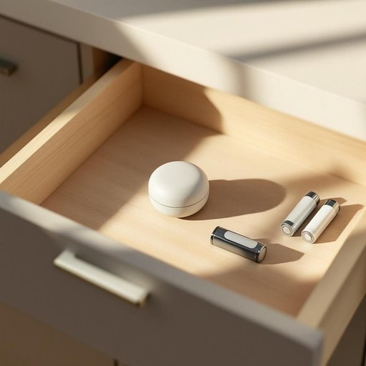

# torch

<h1 style="font-size: 2.5em; font-weight: 300; letter-spacing: 2px; margin: 0; color: #2c3e50;">
/tɔrʧ/
</h1>

---

---

## 例句

Could you please check if the torch in the kitchen drawer still works, since the power's gone out and, given how unpredictable the weather has been lately, it might be wise to keep a fully charged one handy along with some spare batteries in case of another blackout?

*Could(/kʊd/) you(/ju/) please(/pliz/) check(/ʧɛk/) if(/ɪf/) the(/ðə/) torch(/tɔrʧ/) in(/ɪn/) the(/ðə/) kitchen(/ˈkɪʧən/) drawer(/drɔr/) still(/stɪl/) works,(/wərks,/) since(/sɪns/) the(/ðə/) power's(/paʊərz/) gone(/gɔn/) out(/aʊt/) and,(/ənd,/) given(/ˈgɪvɪn/) how(/haʊ/) unpredictable(/ˌənprɪˈdɪktəbəl/) the(/ðə/) weather(/ˈwɛðər/) has(/həz/) been(/bɪn/) lately,(/ˈleɪtli,/) it(/ɪt/) might(/maɪt/) be(/bi/) wise(/waɪz/) to(/tɪ/) keep(/kip/) a(/ə/) fully(/ˈfʊli/) charged(/ʧɑrʤd/) one(/wən/) handy(/ˈhændi/) along(/əˈlɔŋ/) with(/wɪθ/) some(/səm/) spare(/spɛr/) batteries(/ˈbætəriz/) in(/ɪn/) case(/keɪs/) of(/əv/) another(/əˈnəðər/) blackout?(/ˈblæˌkaʊt?/)*

**翻译：** 请您帮忙检查一下厨房抽屉里的手电筒是否还能用。因为停电了，鉴于近期天气多变，备一只充满电的手电筒和一些备用电池，以备再次停电，可能会更为妥当。

---

## 解释

英语单词“torch”作为名词，在家居生活用品的语境中通常指的是便携式手电筒，用于照明，特别是在停电、户外活动或需要短暂补光时使用，这种“torch”一般是电池驱动的小型照明设备。学习者在使用时应注意，“torch”在英式英语中常用来表示手电筒，而在美式英语中则多用“flashlight”，这是一种地域性用法差异。此外，“torch”还可作为火把使用，但在家居语境中主要指手电筒，且作可数名词，复数形式为“torches”，常见搭配有“carry a torch”（携带手电筒）、“use a torch to find”（用手电筒寻找）等，表达时可结合具体场景说明光源性质，比如“battery-powered torch”（电池手电筒）。词源上，“torch”源自古法语“torche”，意指燃烧的粗烛或火把，追溯到拉丁语“torca”或“torquere”，含义有关扭转或燃烧，反映了该词最初指火把的历史。中文中，“torch”在家居生活用品语境下准确翻译为“手电筒”，强调其便携式和电池供电的特点，区别于传统意义上的“火炬”，避免混淆。需注意的是，“torch”作为火把有时带有象征性或仪式性的文化内涵，如奥林匹克火炬，而作为手电筒则无明显褒贬色彩，属于中性词，适合日常使用。

---

<small style="color: #999; font-size: 0.9em;">2025-07-27 09:14:04</small>

