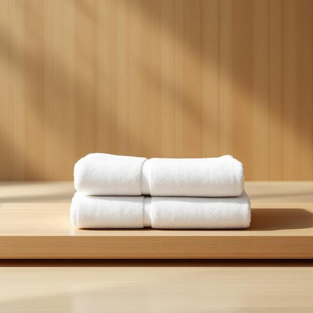

# towel

<h1 style="font-size: 2.5em; font-weight: 300; letter-spacing: 2px; margin: 0; color: #2c3e50;">
/taʊəl/
</h1>

---

---

## 例句

After months of meticulous research, the knowledge he acquired became the foundation upon which the entire project's success was built, illustrating how invaluable knowledge can transform ambitions into tangible achievements.

*After(/ˈæftər/) months(/mənθs/) of(/əv/) meticulous(/məˈtɪkjələs/) research,(/ˈrisərʧ,/) the(/ðə/) knowledge(/ˈnɑlɪʤ/) he(/hi/) acquired(/əkˈwaɪərd/) became(/bɪˈkeɪm/) the(/ðə/) foundation(/faʊnˈdeɪʃən/) upon(/əˈpɑn/) which(/wɪʧ/) the(/ðə/) entire(/ɪnˈtaɪər/) project's(/ˈprɑʤɛkts/) success(/səkˈsɛs/) was(/wɑz/) built,(/bɪlt,/) illustrating(/ˈɪləˌstreɪtɪŋ/) how(/haʊ/) invaluable(/ˌɪnˈvæljəbəl/) knowledge(/ˈnɑlɪʤ/) can(/kən/) transform(/ˈtrænsfɔrm/) ambitions(/æmˈbɪʃənz/) into(/ˈɪntu/) tangible(/ˈtænʤəbəl/) achievements.(/əˈʧivmənts./)*

**翻译：** 经过数月的精心研究，他所获得的知识成为整个项目成功的基石，充分展现了宝贵的知识如何将抱负转化为切实的成就。

---

## 解释

英语单词“towel”作为名词，主要指家居生活中用于擦拭身体或物体表面吸干水分的布料，一般用于浴室、厨房或游泳池等场合，如浴巾、毛巾、厨房用擦手巾等。在语境中，towel常与动词如“use”、“dry oneself with”、“hang up”搭配，如“dry yourself with a towel”表达“用毛巾擦干身体”，学习者需注意其不可数和可数用法的区别：一般指一块或几块毛巾时为可数，“a towel”“two towels”，泛指吸水类布品时也有不可数用法。towel通常与形容词搭配，如“bath towel”（浴巾）、“hand towel”（手巾）、“kitchen towel”（厨房用巾）等，表达更具体的用途。这个词源自中古英语“towelle”，来自古法语“toaille”，而后源于拉丁语“toalia”，意指布料，反映了该物品的实体属性和功能。中文语境中，towel准确的翻译是“毛巾”或“毛巾类织物”，具体可根据用途细分为“浴巾”、“手巾”、“厨房毛巾”等，强调其干燥、吸水的特性，没有特殊褒贬色彩，属于中性生活用品词汇，无文化禁忌，学习者应注意其与类似词汇如“cloth”（布）、“napkin”（餐巾）区别，确保用法准确。

---

<small style="color: #999; font-size: 0.9em;">2025-07-27 09:14:04</small>

