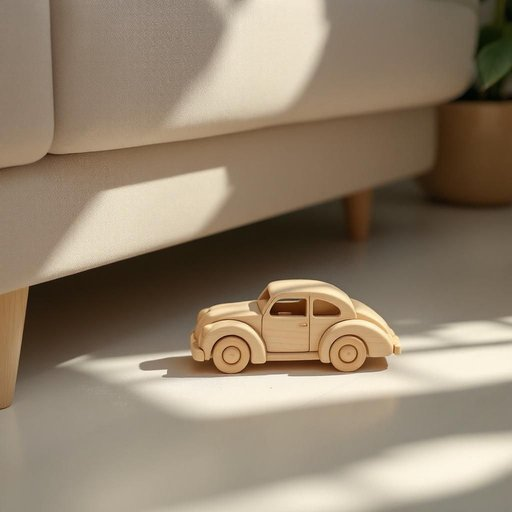

# toy

<h1 style="font-size: 2.5em; font-weight: 300; letter-spacing: 2px; margin: 0; color: #2c3e50;">
/tɔɪ/
</h1>

---

---

## 例句

While tidying up the living room yesterday, I found that the toy, which had been tucked away under the sofa for weeks and covered in a thin layer of dust, was actually a rather intricate wooden puzzle shaped like a vintage car, demonstrating both the child's growing interest in craftsmanship and the importance of keeping such cherished items safe amidst everyday clutter.

*While(/waɪl/) tidying(/tidying*/) up(/əp/) the(/ðə/) living(/ˈlɪvɪŋ/) room(/rum/) yesterday,(/ˈjɛstərˌdeɪ,/) I(/aɪ/) found(/faʊnd/) that(/ðət/) the(/ðə/) toy,(/tɔɪ,/) which(/wɪʧ/) had(/hæd/) been(/bɪn/) tucked(/təkt/) away(/əˈweɪ/) under(/ˈəndər/) the(/ðə/) sofa(/ˈsoʊfə/) for(/fər/) weeks(/wiks/) and(/ənd/) covered(/ˈkəvərd/) in(/ɪn/) a(/ə/) thin(/θɪn/) layer(/leɪər/) of(/əv/) dust,(/dəst,/) was(/wɑz/) actually(/ˈæˌkʧuəli/) a(/ə/) rather(/ˈrəðər/) intricate(/ˈɪntrəkət/) wooden(/ˈwʊdən/) puzzle(/ˈpəzəl/) shaped(/ʃeɪpt/) like(/laɪk/) a(/ə/) vintage(/ˈvɪntɪʤ/) car,(/kɑr,/) demonstrating(/ˈdɛmənˌstreɪtɪŋ/) both(/boʊθ/) the(/ðə/) child's(/ʧaɪldz/) growing(/groʊɪŋ/) interest(/ˈɪntəˌrɛst/) in(/ɪn/) craftsmanship(/ˈkræftsmənˌʃɪp/) and(/ənd/) the(/ðə/) importance(/ˌɪmˈpɔrtəns/) of(/əv/) keeping(/ˈkipɪŋ/) such(/səʧ/) cherished(/ˈʧɛrɪʃt/) items(/ˈaɪtəmz/) safe(/seɪf/) amidst(/əˈmɪdst/) everyday(/ˈɛvriˈdeɪ/) clutter.(/ˈklətər./)*

**翻译：** 昨天整理客厅时，我发现那个被藏在沙发下好几周、蒙着一层薄薄灰尘的玩具，竟然是一件结构复杂的木制拼图，形状像一辆复古汽车，既展现了孩子对手工艺不断增长的兴趣，也凸显了在日常杂乱中妥善保存这些珍贵物品的重要性。

---

## 解释

英语单词“toy”作为名词在家居生活用品场景中，通常指供儿童娱乐的玩具，如积木、娃娃、拼图等，这些物品常见于家庭环境中，帮助孩子学习和娱乐。使用时，“toy”可以单数也可以复数形式“toys”，常见搭配包括“children’s toys”（儿童玩具）、“soft toy”（毛绒玩具）、“toy car”（玩具车）等，表达时应注意区分具体玩具的种类和用途。此外，“toy”还可用作动词，表示“玩弄”或“摆弄”，但在家居用品语境中主要以名词使用为主。学习者应了解，“toy”作为名词一般可数，且在句中充当主语或宾语时需注意冠词的使用，如“a toy”、“the toys”等。词源方面，“toy”起源于中古英语，最初含义与愉悦和娱乐相关，逐渐演变为指儿童或宠物用的小型娱乐物品。在中文语境中，“toy”最准确的翻译是“玩具”，强调它是儿童娱乐的道具。需要注意的是，“toy”在某些语境下也可能带有轻视或贬义色彩，如形容某物不严肃、草率制作，或指人被轻视为把玩对象，但在家居生活用品场景中通常无此负面含义，更多侧重实用和娱乐功能。整体来说，“toy”作为家居生活用品名词，表达的是一种儿童日常生活中的休闲用品，具有文化普遍性和中性含义。

---

<small style="color: #999; font-size: 0.9em;">2025-07-27 09:14:04</small>

