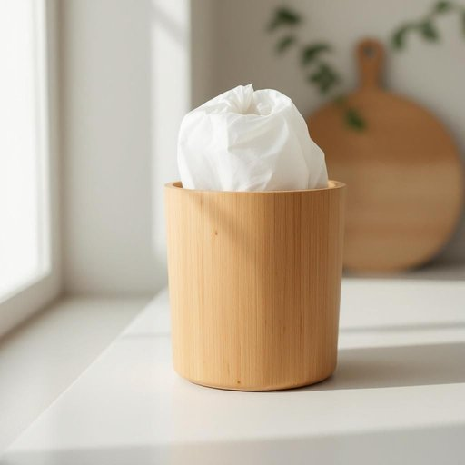

# trashcan

<h1 style="font-size: 2.5em; font-weight: 300; letter-spacing: 2px; margin: 0; color: #2c3e50;">
/trashcan*/
</h1>

---

---

## 例句

Could you please take out the rubbish from the kitchen and make sure to replace the liner in the trashcan, which has started to smell because it wasn’t emptied yesterday, before you head out to the shops?

*Could(/kʊd/) you(/ju/) please(/pliz/) take(/teɪk/) out(/aʊt/) the(/ðə/) rubbish(/ˈrəbɪʃ/) from(/frəm/) the(/ðə/) kitchen(/ˈkɪʧən/) and(/ənd/) make(/meɪk/) sure(/ʃʊr/) to(/tɪ/) replace(/ˌriˈpleɪs/) the(/ðə/) liner(/ˈlaɪnər/) in(/ɪn/) the(/ðə/) trashcan,(/trashcan*,/) which(/wɪʧ/) has(/həz/) started(/ˈstɑrtɪd/) to(/tɪ/) smell(/smɛl/) because(/bɪˈkəz/) it(/ɪt/) wasn’t(/wasn’t*/) emptied(/ˈɛmtid/) yesterday,(/ˈjɛstərˌdeɪ,/) before(/ˌbiˈfɔr/) you(/ju/) head(/hɛd/) out(/aʊt/) to(/tɪ/) the(/ðə/) shops?(/ʃɑps?/)*

**翻译：** 你能在出门去商店之前，把厨房的垃圾拿出去吗？记得换上新的垃圾袋，因为垃圾桶里面的垃圾昨天没有倒，已经开始有味道了。

---

## 解释

英语单词“trashcan”作为名词，通常指家居环境中用来盛放废弃物的容器，即“垃圾桶”。它常见于日常生活场合，如厨房、客厅、办公室等，用来临时存放生活垃圾、废纸或食品包装等。学习者在使用“trashcan”时需注意它是可数名词，复数形式为“trashcans”；此外，“trashcan”通常与动词“empty”（清空）、“throw away”（扔掉）、“put in”（放入）等搭配使用，如“empty the trashcan”（倒垃圾桶）、“put the trash in the trashcan”（把垃圾放进垃圾桶）。该词来源于“trash”（垃圾）和“can”（罐、桶）的结合，形象地描述了盛装垃圾的容器，属于合成词。值得注意的是，“trashcan”在美式英语中常用，而在英式英语中更常用“bin”来表示同义物品，学习者需要根据语境选择合适词汇。在中文语境中，“trashcan”准确翻译为“垃圾桶”，含义中性，无褒贬色彩，通常只指实用的生活用品，但在某些特定语境下也可引申为比喻“无用之物”或“废物”，需结合具体语境判断。总的来说，“trashcan”是一个日常且实用的名词，使用时应注意其具体语境和地区语言差异。

---

<small style="color: #999; font-size: 0.9em;">2025-07-27 09:14:04</small>

