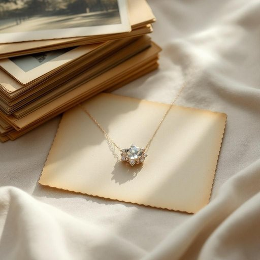

# trinket

<h1 style="font-size: 2.5em; font-weight: 300; letter-spacing: 2px; margin: 0; color: #2c3e50;">
/ˈtrɪŋkət/
</h1>

---

---

## 例句

While tidying up the living room, I found that delicate trinket, which Grandma gave us on her last visit, carefully nestled among a stack of old photographs and faded postcards, reminding me how such small, seemingly insignificant items can carry a lifetime of memories and stories.

*While(/waɪl/) tidying(/tidying*/) up(/əp/) the(/ðə/) living(/ˈlɪvɪŋ/) room,(/rum,/) I(/aɪ/) found(/faʊnd/) that(/ðət/) delicate(/ˈdɛləkət/) trinket,(/ˈtrɪŋkət,/) which(/wɪʧ/) Grandma(/ˈgrændmɑ/) gave(/geɪv/) us(/ˈjuˈɛs/) on(/ɔn/) her(/hər/) last(/læst/) visit,(/ˈvɪzɪt,/) carefully(/ˈkɛrfəli/) nestled(/ˈnɛsəld/) among(/əˈməŋ/) a(/ə/) stack(/stæk/) of(/əv/) old(/oʊld/) photographs(/ˈfoʊtəˌgræfs/) and(/ənd/) faded(/ˈfeɪdɪd/) postcards,(/ˈpoʊˌskɑrdz,/) reminding(/riˈmaɪndɪŋ/) me(/mi/) how(/haʊ/) such(/səʧ/) small,(/smɔl,/) seemingly(/ˈsimɪŋli/) insignificant(/ˌɪnsɪgnˈjɪfɪkənt/) items(/ˈaɪtəmz/) can(/kən/) carry(/ˈkɛri/) a(/ə/) lifetime(/ˈlaɪfˌtaɪm/) of(/əv/) memories(/ˈmɛməriz/) and(/ənd/) stories.(/ˈstɔriz./)*

**翻译：** 整理客厅时，我发现了那件精致的小饰品，奶奶上次来访时送给我们的，它静静地放在一叠旧照片和泛黄的明信片中，提醒我这些看似微不足道的小物件，却能承载一生的回忆与故事。

---

## 解释

英语单词“trinket”作为名词，在家居生活用品语境中通常指较小且价值不高但装饰性强的物品，例如小饰品、装饰品或小型纪念品，常见于陈列柜、书桌或卧室的梳妆台上。使用时，trinket多用作可数名词，常见搭配包括“a trinket box”（小饰品盒）、“collect trinkets”（收集小饰品）等，注意其复数形式为“trinkets”，且不用于表示贵重或实用的物品。该词源自中古法语“trinquet”，进一步追溯至古法语，原指小玩物或小饰品，体现出物品小巧玲珑但通常没有重大价值或实用功能的含义。在中文语境中，trinket多译为“小饰品”、“小玩意儿”或“装饰性小物”，强调其轻巧和装饰用途，带有亲切但略带轻视的意味，因其价值不高且多为非必需品，偶有贬义色彩，如“没什么用的小玩意”，但整体语气较为中性，更多反映对物品外观和情感价值的重视而非物质价值。英语学习者使用时应注意trinket多用于形容细小、轻巧或无实际用途的装饰品，不宜与“jewel”（珠宝）、“antique”（古玩）等贵重或功能性物品混淆。

---

<small style="color: #999; font-size: 0.9em;">2025-07-27 09:14:04</small>

