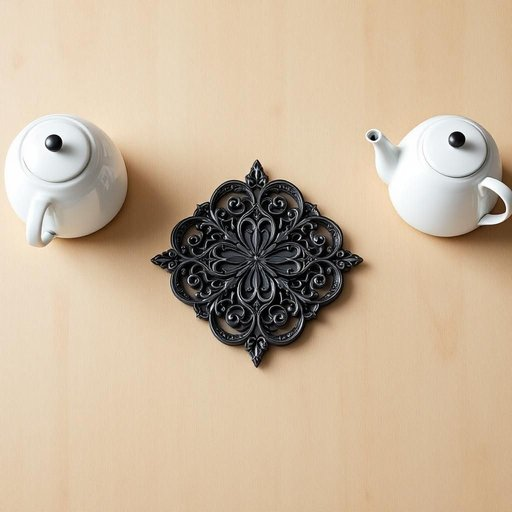

# trivet

<h1 style="font-size: 2.5em; font-weight: 300; letter-spacing: 2px; margin: 0; color: #2c3e50;">
/trivet*/
</h1>

---

---

## 例句

Could you please hand me the trivet that’s sitting next to the kettle on the countertop, the one with the intricate wrought-iron design that mum got from that vintage shop last summer, since I don’t want to place the hot saucepan directly on the wooden table and risk leaving scorch marks?

*Could(/kʊd/) you(/ju/) please(/pliz/) hand(/hænd/) me(/mi/) the(/ðə/) trivet(/trivet*/) that’s(/that’s*/) sitting(/ˈsɪtɪŋ/) next(/nɛkst/) to(/tɪ/) the(/ðə/) kettle(/ˈkɛtəl/) on(/ɔn/) the(/ðə/) countertop,(/ˈkaʊntərˌtɑp,/) the(/ðə/) one(/wən/) with(/wɪθ/) the(/ðə/) intricate(/ˈɪntrəkət/) wrought-iron(/wrought-iron*/) design(/dɪˈzaɪn/) that(/ðət/) mum(/məm/) got(/gɑt/) from(/frəm/) that(/ðət/) vintage(/ˈvɪntɪʤ/) shop(/ʃɑp/) last(/læst/) summer,(/ˈsəmər,/) since(/sɪns/) I(/aɪ/) don’t(/don’t*/) want(/wɔnt/) to(/tɪ/) place(/pleɪs/) the(/ðə/) hot(/hɑt/) saucepan(/ˈsɔˌspæn/) directly(/dɪˈrɛkli/) on(/ɔn/) the(/ðə/) wooden(/ˈwʊdən/) table(/ˈteɪbəl/) and(/ənd/) risk(/rɪsk/) leaving(/ˈlivɪŋ/) scorch(/skɔrʧ/) marks?(/mɑrks?/)*

**翻译：** 您能把厨房台面上、水壶旁边那个妈妈去年夏天从那家复古店买来、带有精致锻铁花纹的隔热垫递给我吗？我不想直接把热锅放在木桌上，以免留下烫痕。

---

## 解释

“trivet”作为名词在家居生活用品领域主要指用于盛放热锅或热锅具下方的支架或托架，通常由金属、木材或陶瓷制成，放置在餐桌或厨房台面上，以保护桌面免受热锅直接接触而造成的烫损或烧伤。在具体使用场合上，trivet常见于家庭厨房、餐厅或用餐场景中，比如当人们从炉灶上端出刚煮好的热锅时，会将热锅放在trivet上避免损坏桌面。英语学习者在使用“trivet”时应注意其为可数名词，通常搭配动词如“place”、“put”或介词短语“on a trivet”，例如“Place the hot pan on the trivet.”此外，“trivet”一般不用于抽象或隐喻表达，仅限实物意义，因此在表达保护桌面的动作时使用最为准确。从词源角度看，“trivet”源自中古英语“trivet”，进一步来自拉丁语“tri-”意为三，加上“vetus”（旧的），原指带三个脚的三脚铁架，最初设计用于放置锅具，因此名称中带有“三脚架”之意。中文中，“trivet”通常翻译为“锅垫”或“锅架”，强调其保护桌面、防止热锅直接接触的功能。在日常生活中，这一词汇偏中性，无褒贬色彩，也无特殊文化内涵，是厨房和餐桌用品中常见且实用的物件，理解为“防烫托架”最为准确。

---

<small style="color: #999; font-size: 0.9em;">2025-07-27 09:14:04</small>

