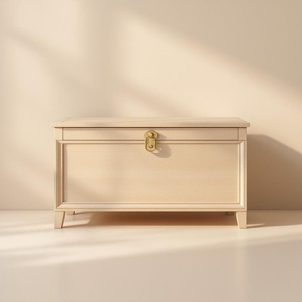

# trunk

<h1 style="font-size: 2.5em; font-weight: 300; letter-spacing: 2px; margin: 0; color: #2c3e50;">
/trəŋk/
</h1>

---

---

## 例句

The ancient trunk, adorned with intricate carvings and filled with heirlooms passed down through generations, stood as a silent testament to the family's rich history and enduring legacy.

*The(/ðə/) ancient(/ˈeɪnʧənt/) trunk,(/trəŋk,/) adorned(/əˈdɔrnd/) with(/wɪθ/) intricate(/ˈɪntrəkət/) carvings(/ˈkɑrvɪŋz/) and(/ənd/) filled(/fɪld/) with(/wɪθ/) heirlooms(/ˈɛˌrlumz/) passed(/pæst/) down(/daʊn/) through(/θru/) generations,(/ˌʤɛnərˈeɪʃənz,/) stood(/stʊd/) as(/ɛz/) a(/ə/) silent(/ˈsaɪlənt/) testament(/ˈtɛstəmənt/) to(/tɪ/) the(/ðə/) family's(/ˈfæməliz/) rich(/rɪʧ/) history(/ˈhɪstəri/) and(/ənd/) enduring(/ɪnˈdʊrɪŋ/) legacy.(/ˈlɛgəsi./)*

**翻译：** 那只古老的木箱，雕刻复杂精美，内藏代代相传的传家宝，静静地见证着这个家族丰富的历史和绵延不绝的传承。

---

## 解释

英语单词"trunk"在家居生活用品场景中作为名词，主要指一种大而结实的箱子或箱柜，常用于储存衣物、被褥、文件等物品，尤其适合长时间存放或搬运重物。这类trunk通常外形坚固，有时带有金属锁扣和把手，适合家庭、搬家或旅行中使用。使用时，英语学习者应注意它作为可数名词，复数形式为"trunks"，且通常与表示存储或运输的动词如"pack," "store," "carry," "lock"等搭配。此外，"trunk"还有其他含义，如汽车后备箱或大象的鼻子，使用时需根据语境区分。在表达技巧上，"a storage trunk"或"an antique trunk"是常见搭配，具体描述其功能和风格时较为地道。词源上，"trunk"来源于中古英语，原指树干，引申为大而圆柱形的物体，后用于指代大型储物箱，体现其坚固且容量大的特点。在中文语境中，"trunk"作为家居生活用品时，准确翻译为“行李箱”、“储物箱”或“大箱子”，根据具体形态和用途有所差别，需避免与汽车后备箱（汽车用语中的后备箱）混淆。总的来说，此词在家居生活中无褒贬色彩，属于中性实用名词，文化内涵较少，重点在于物品的储存与搬运功能。

---

<small style="color: #999; font-size: 0.9em;">2025-07-27 09:14:04</small>

