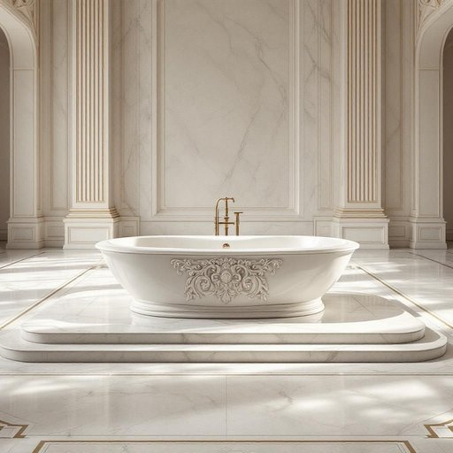

# tub

<h1 style="font-size: 2.5em; font-weight: 300; letter-spacing: 2px; margin: 0; color: #2c3e50;">
/təb/
</h1>

---

---

## 例句

After the ancient tub, crafted from marble and encrusted with delicate carvings, was restored and placed in the grand hall, it became the centerpiece of the mansion, drawing admiration from every visitor who marveled at its historical significance and intricate design.

*After(/ˈæftər/) the(/ðə/) ancient(/ˈeɪnʧənt/) tub,(/təb,/) crafted(/ˈkræftɪd/) from(/frəm/) marble(/ˈmɑrbəl/) and(/ənd/) encrusted(/ɛnˈkrəstɪd/) with(/wɪθ/) delicate(/ˈdɛləkət/) carvings,(/ˈkɑrvɪŋz,/) was(/wɑz/) restored(/rɪˈstɔrd/) and(/ənd/) placed(/pleɪst/) in(/ɪn/) the(/ðə/) grand(/grænd/) hall,(/hɔl,/) it(/ɪt/) became(/bɪˈkeɪm/) the(/ðə/) centerpiece(/ˈsɛntərˌpis/) of(/əv/) the(/ðə/) mansion,(/ˈmænʃən,/) drawing(/drɔɪŋ/) admiration(/ˌædmərˈeɪʃən/) from(/frəm/) every(/ˈɛvəri/) visitor(/ˈvɪzɪtər/) who(/hu/) marveled(/ˈmɑrvɛld/) at(/æt/) its(/ɪts/) historical(/hɪˈstɔrɪkəl/) significance(/sɪgˈnɪfɪkəns/) and(/ənd/) intricate(/ˈɪntrəkət/) design.(/dɪˈzaɪn./)*

**翻译：** 那座用大理石制成、镶嵌着细腻雕刻的古老浴缸经过修复后被安置在大厅中央，成为宅邸的核心景观，吸引每一位访客驻足，赞叹其深厚的历史意义与精巧的设计。

---

## 解释

英语单词“tub”作为名词在家居生活用品的语境中，主要指一种用于装水洗澡的大桶状容器，常见于浴室环境，比如家庭中的浴缸。此外，“tub”也可指用于装其他液体或物品的桶、盆状容器，如冰淇淋桶或洗衣桶等。使用时，英语学习者需要注意“tub”通常指较小或便携式的容器，而不是大型的固定设施，如“bathtub”才是指家里固定的浴缸。常见搭配包括“take a tub”（泡澡）、“ice cream tub”（冰淇淋盒）等，表达时可结合具体物品或动作，避免用错语境。语法上，“tub”是可数名词，复数形式为“tubs”，在句中常作为具体名词使用。该词源自中古英语“tubbe”，可能来自拉丁语“tubus”，指圆柱形容器，反映其桶状或盆状的形态特征。在中文语境中，“tub”可准确翻译为“桶”或“盆”，具体含义通常依上下文确定，例如家庭洗澡时多译为“浴缸”或“浴盆”，装食品时则译为“桶”或“盒”。“tub”常带有中性词义，没有显著褒贬色彩，但在非正式场合描述体型时也有俚语用法，含有幽默或轻微调侃意味，这一点英语学习者应加以区分，避免混淆正式家居用品含义与俚语用法。

---

<small style="color: #999; font-size: 0.9em;">2025-07-27 09:14:04</small>

