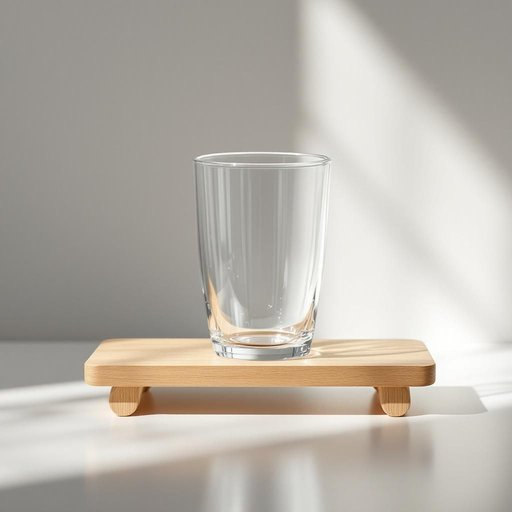

# tumbler

<h1 style="font-size: 2.5em; font-weight: 300; letter-spacing: 2px; margin: 0; color: #2c3e50;">
/ˈtəmblər/
</h1>

---

---

## 例句

After washing the crystal tumbler carefully with warm soapy water, she placed it upside down on the drying rack, reminding herself to polish it later so that it would sparkle perfectly next to the other glassware on the dining table.

*After(/ˈæftər/) washing(/ˈwɑʃɪŋ/) the(/ðə/) crystal(/ˈkrɪstəl/) tumbler(/ˈtəmblər/) carefully(/ˈkɛrfəli/) with(/wɪθ/) warm(/wɔrm/) soapy(/ˈsoʊpi/) water,(/ˈwɔtər,/) she(/ʃi/) placed(/pleɪst/) it(/ɪt/) upside(/ˈəpˈsaɪd/) down(/daʊn/) on(/ɔn/) the(/ðə/) drying(/draɪɪŋ/) rack,(/ræk,/) reminding(/riˈmaɪndɪŋ/) herself(/hərˈsɛlf/) to(/tɪ/) polish(/ˈpɑlɪʃ/) it(/ɪt/) later(/ˈleɪtər/) so(/soʊ/) that(/ðət/) it(/ɪt/) would(/wʊd/) sparkle(/ˈspɑrkəl/) perfectly(/ˈpərfəktli/) next(/nɛkst/) to(/tɪ/) the(/ðə/) other(/ˈəðər/) glassware(/ˈglæsˌwɛr/) on(/ɔn/) the(/ðə/) dining(/ˈdaɪnɪŋ/) table.(/ˈteɪbəl./)*

**翻译：** 她用温热的肥皂水仔细清洗水晶杯后，将其倒扣在晾架上，提醒自己稍后要将其擦拭干净，使其在餐桌上与其他玻璃器皿一同闪耀光彩。

---

## 解释

英语单词tumbler在家居生活用品的语境中通常指一种没有柄的直身玻璃杯，常用于饮水或饮料，尤其适合盛装烈酒、威士忌或普通饮用水，使用场合多见于家庭餐桌、酒吧或饮料服务场所。学习者在使用tumbler时应注意其作为可数名词，复数形式为tumblers，常见搭配包括a tumbler of water（一杯水）、a set of tumblers（一套玻璃杯），还可以与形容词连用如plastic tumbler（塑料杯）、glass tumbler（玻璃杯），表达具体材质或用途。词源方面，tumbler最初源自中世纪英语，原意指“翻跟头者”或“杂技演员”，后引申为形容杯子因底部设计可能导致摇晃、翻倒，这种设计使得杯子能“翻滚”，因此得名。其在中文语境中准确翻译为“直身无柄玻璃杯”或简称“玻璃杯”，通常无褒贬色彩，纯粹描述饮具，不含特殊文化内涵或隐喻。需要注意的是，tumbler与其他饮具如mug（带柄的大杯）、glass（泛指玻璃杯）或cup（有柄杯子）在形状和用途上有区别，掌握这些细微差异有助于准确使用和理解。

---

<small style="color: #999; font-size: 0.9em;">2025-07-27 09:14:04</small>

