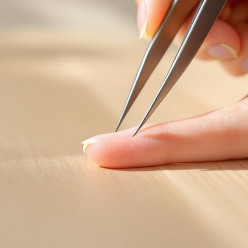

# tweezers

<h1 style="font-size: 2.5em; font-weight: 300; letter-spacing: 2px; margin: 0; color: #2c3e50;">
/tˈwizərz/
</h1>

---

---

## 例句

Could you please hand me the tweezers from the bathroom drawer, the ones with the fine tips we bought last month, because I need to carefully pluck this stubborn splinter that's been irritating my finger all afternoon?

*Could(/kʊd/) you(/ju/) please(/pliz/) hand(/hænd/) me(/mi/) the(/ðə/) tweezers(/tˈwizərz/) from(/frəm/) the(/ðə/) bathroom(/ˈbæθˌrum/) drawer,(/drɔr,/) the(/ðə/) ones(/wənz/) with(/wɪθ/) the(/ðə/) fine(/faɪn/) tips(/tɪps/) we(/wi/) bought(/bɔt/) last(/læst/) month,(/mənθ,/) because(/bɪˈkəz/) I(/aɪ/) need(/nid/) to(/tɪ/) carefully(/ˈkɛrfəli/) pluck(/plək/) this(/ðɪs/) stubborn(/ˈstəbərn/) splinter(/ˈsplɪntər/) that's(/ðæts/) been(/bɪn/) irritating(/ˈɪrəˌteɪtɪŋ/) my(/maɪ/) finger(/ˈfɪŋgər/) all(/ɔl/) afternoon?(/ˌæftərˈnun?/)*

**翻译：** 你能帮我从浴室抽屉里拿一下那把上个月买的细尖镊子吗？我需要仔细拔出这根整个下午一直刺痛我手指的顽固刺片。

---

## 解释

英语单词“tweezers”作为名词，指的是一种小巧的金属工具，通常由两根细长的金属片组成，前端合拢，用于夹取细小物体，常见于家居生活用品中，如拔眉毛、夹取细小物件、处理伤口时夹取异物等具体场合和语境。学习者在使用“tweezers”时应注意其总是以复数形式出现，且多用作复数名词，即使指单一工具，因此说“一把镊子”用英语应表达为“a pair of tweezers”，而非“a tweezer”。常见搭配有“use tweezers”（使用镊子）、“a pair of tweezers”（一把镊子）、“tweezers for eyebrow plucking”（用于拔眉毛的镊子）等。词源方面，“tweezers”来源于法语“pincettes”，为“pincer”（夹，捏）的一种变体，进入英语后形成复数形式，反映其工具结构的两片组合。中文语境中，“tweezers”准确翻译为“镊子”或“眉钳”，强调其小巧、精密的特性及夹取细小物件的功能，无特殊褒贬含义，也无明显文化色彩，是家用和医疗中常见的工具名称。

---

<small style="color: #999; font-size: 0.9em;">2025-07-27 09:14:04</small>

