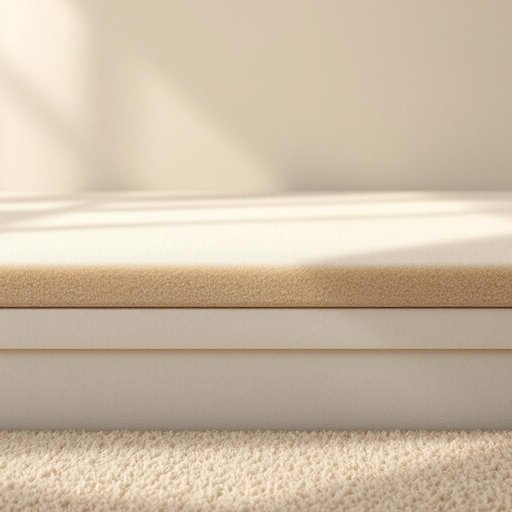

# underlay

<h1 style="font-size: 2.5em; font-weight: 300; letter-spacing: 2px; margin: 0; color: #2c3e50;">
/underlay*/
</h1>

---

---

## 例句

Before we lay down the new carpet, we should make sure the underlay, which acts as a cushioning layer to absorb sound and provide extra warmth, is properly fitted and free from any bumps or wrinkles that might become uncomfortable over time.

*Before(/ˌbiˈfɔr/) we(/wi/) lay(/leɪ/) down(/daʊn/) the(/ðə/) new(/nu/) carpet,(/ˈkɑrpət,/) we(/wi/) should(/ʃʊd/) make(/meɪk/) sure(/ʃʊr/) the(/ðə/) underlay,(/underlay*,/) which(/wɪʧ/) acts(/ækts/) as(/ɛz/) a(/ə/) cushioning(/ˈkʊʃənɪŋ/) layer(/leɪər/) to(/tɪ/) absorb(/əbˈzɔrb/) sound(/saʊnd/) and(/ənd/) provide(/prəˈvaɪd/) extra(/ˈɛkstrə/) warmth,(/wɔrmθ,/) is(/ɪz/) properly(/ˈprɑpərli/) fitted(/ˈfɪtɪd/) and(/ənd/) free(/fri/) from(/frəm/) any(/ˈɛni/) bumps(/bəmps/) or(/ər/) wrinkles(/ˈrɪŋkəlz/) that(/ðət/) might(/maɪt/) become(/bɪˈkəm/) uncomfortable(/ənˈkəmfərtəbəl/) over(/ˈoʊvər/) time.(/taɪm./)*

**翻译：** 在铺设新地毯之前，我们应确保垫层贴合良好且无任何凸起或皱纹，因为垫层不仅起到缓冲作用，吸收声音，还能提供额外的温暖，避免随着时间推移带来不适。

---

## 解释

英语单词“underlay”作为名词在家居生活用品场景中，指的是铺设在地毯或地板下方的一层衬垫材料，主要用于增加地面舒适度、隔音保温或保护地板表面。具体使用场合通常是在装修、铺设地毯或木地板时，会提到“carpet underlay”或“floor underlay”，表示地毯或地板的下垫层。英语学习者在使用“underlay”时需注意其作为名词时往往与表示地面材料的词搭配，如“carpet underlay”（地毯垫）、“foam underlay”（泡沫垫）。此外，“underlay”作为可数名词时多指具体的一块衬垫，复数形式为“underlays”。在语法上，它通常出现在名词短语中作为中心词，也可与形容词连用表示材质或功能，如“thick underlay”（厚衬垫）。词源方面，“underlay”由“under”（在下面）和“lay”（铺设）组合而成，最初用于描述铺设物品时在下面铺的一层，体现了其实用功能和位置属性。在中文语境中，“underlay”准确翻译为“衬垫”、“垫层”或“底垫”，强调其置于地毯或地板之下辅助舒适与保护的作用，无褒贬色彩，属于中性词汇，具有明显的实用功能和装修专业色彩，不带有特殊文化内涵。

---

<small style="color: #999; font-size: 0.9em;">2025-07-27 09:14:04</small>

