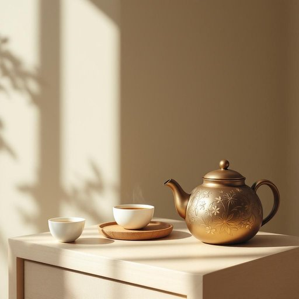

# urn

<h1 style="font-size: 2.5em; font-weight: 300; letter-spacing: 2px; margin: 0; color: #2c3e50;">
/ərn/
</h1>

---

---

## 例句

After the guests arrived and settled comfortably in the living room, she carefully placed the antique brass urn, which had been in her family for generations and was ornately decorated with intricate floral patterns, on the sideboard next to the freshly brewed tea set, ensuring that it was both a functional centerpiece and a conversation starter.

*After(/ˈæftər/) the(/ðə/) guests(/gɛsts/) arrived(/əraɪvd/) and(/ənd/) settled(/ˈsɛtəld/) comfortably(/ˈkəmfərtəbli/) in(/ɪn/) the(/ðə/) living(/ˈlɪvɪŋ/) room,(/rum,/) she(/ʃi/) carefully(/ˈkɛrfəli/) placed(/pleɪst/) the(/ðə/) antique(/ænˈtik/) brass(/bræs/) urn,(/ərn,/) which(/wɪʧ/) had(/hæd/) been(/bɪn/) in(/ɪn/) her(/hər/) family(/ˈfæməli/) for(/fər/) generations(/ˌʤɛnərˈeɪʃənz/) and(/ənd/) was(/wɑz/) ornately(/ɔrˈneɪtli/) decorated(/ˈdɛkərˌeɪtɪd/) with(/wɪθ/) intricate(/ˈɪntrəkət/) floral(/ˈflɔrəl/) patterns,(/ˈpætərnz,/) on(/ɔn/) the(/ðə/) sideboard(/sideboard*/) next(/nɛkst/) to(/tɪ/) the(/ðə/) freshly(/ˈfrɛʃli/) brewed(/brud/) tea(/ti/) set,(/sɛt,/) ensuring(/ɪnˈʃʊrɪŋ/) that(/ðət/) it(/ɪt/) was(/wɑz/) both(/boʊθ/) a(/ə/) functional(/ˈfəŋkʃənəl/) centerpiece(/ˈsɛntərˌpis/) and(/ənd/) a(/ə/) conversation(/ˌkɑnvərˈseɪʃən/) starter.(/ˈstɑrtər./)*

**翻译：** 客人们到达并舒适地安顿在客厅后，她小心翼翼地将那只传承了数代的古董铜壶安置在餐边柜上，壶身装饰着精致繁复的花卉图案，旁边摆放着刚沏好的茶具，确保它既是实用的点睛之物，又能成为引发谈话的话题。

---

## 解释

英语单词“urn”在家居生活用品的语境中作为名词，主要指一种带盖且通常体积较大的容器，用于盛放液体，如热水、咖啡或茶，常见于家庭厨房、办公室或聚会场合的热饮自助设备。此外，urn还可以指用来存放骨灰的骨灰罐，但在家居生活用品环境下，更多侧重于饮水或保温容器的含义。英语学习者在使用“urn”时应注意，它通常作为可数名词使用，复数形式为“urns”，一般搭配的常见表达包括“tea urn”（茶水壶）、“coffee urn”（咖啡壶）等，且常与动词“fill”（装满）、“pour”（倒）、“heat”（加热）等连用，以表达容器的具体用途或动作。词源上，“urn”源自拉丁语“urna”，原指古罗马用于盛放液体或灰烬的容器，后引申至现代各类密封容器。中文中“urn”根据具体语境可准确翻译为“骨灰罐”或“热水壶”、“茶水壶”等，在家居生活用品领域通常译作“热水壶”或“保温壶”。该词语本身在语言使用上较为中性，无特殊褒贬色彩，但因涉及骨灰罐时，带有一定的庄重和敬意，因此需要根据语境慎重使用。

---

<small style="color: #999; font-size: 0.9em;">2025-07-27 09:14:04</small>

