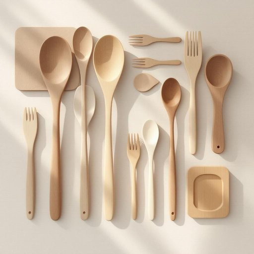

# utensil

<h1 style="font-size: 2.5em; font-weight: 300; letter-spacing: 2px; margin: 0; color: #2c3e50;">
/juˈtɛnsəl/
</h1>

---

---

## 例句

The garden was filled with vibrant flowers, and near the fountain, a mysterious wooden box sat partially buried beneath the ancient oak tree, its intricate carvings hinting at stories untold and secrets waiting to be discovered.

*The(/ðə/) garden(/ˈgɑrdən/) was(/wɑz/) filled(/fɪld/) with(/wɪθ/) vibrant(/ˈvaɪbrənt/) flowers,(/flaʊərz,/) and(/ənd/) near(/nɪr/) the(/ðə/) fountain,(/ˈfaʊntən,/) a(/ə/) mysterious(/mɪˈstɪriəs/) wooden(/ˈwʊdən/) box(/bɑks/) sat(/sæt/) partially(/ˈpɑrʃəli/) buried(/ˈbɛrid/) beneath(/bɪˈniθ/) the(/ðə/) ancient(/ˈeɪnʧənt/) oak(/oʊk/) tree,(/tri,/) its(/ɪts/) intricate(/ˈɪntrəkət/) carvings(/ˈkɑrvɪŋz/) hinting(/ˈhɪntɪŋ/) at(/æt/) stories(/ˈstɔriz/) untold(/ənˈtoʊld/) and(/ənd/) secrets(/ˈsikrɪts/) waiting(/ˈweɪtɪŋ/) to(/tɪ/) be(/bi/) discovered.(/dɪˈskəvərd./)*

**翻译：** 花园中盛开着鲜艳的花朵，喷泉旁，一只神秘的木箱半埋在古老橡树下，精致的雕刻暗示着未被诉说的故事和等待被揭开的秘密。

---

## 解释

“utensil”作为名词在家居生活用品场景中，通常指日常厨房或餐桌上使用的各种工具和器皿，如锅、铲子、刀叉勺等，其使用场合多见于描述烹饪、饮食准备或餐具整理时。在英语学习中，使用“utensil”时需注意其通常为可数名词，常用复数形式“utensils”指一组或多种厨具，常与形容词连用如“kitchen utensils”（厨房用具）、“cooking utensils”（烹饪用具），以及搭配动词如“use utensils”（使用器具）、“clean utensils”（清洗器具）等，表达时可具体说明类别或功能以增强语境准确性。词源上，“utensil”源自拉丁语“utensilia”，意为“用于使用的东西”，通过中古法语进入英语，最初泛指所有实用工具，现主要限定为家用器械，尤其厨房餐具。在中文语境中，“utensil”常被译作“器具”、“用具”或“厨具”，准确体现其为辅助家庭生活特别是烹饪餐饮活动的工具的含义，无明显褒贬色彩，属于中性词汇，文化层面反映的是生活便利和日常实用功能，因而在表达中强调其实用性和工具属性，避免过于笼统或泛化。

---

<small style="color: #999; font-size: 0.9em;">2025-07-27 09:14:04</small>

