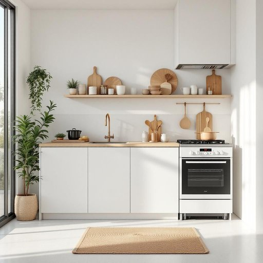

# utility

<h1 style="font-size: 2.5em; font-weight: 300; letter-spacing: 2px; margin: 0; color: #2c3e50;">
/juˈtɪləti/
</h1>

---

---

## 例句

Before we decide on installing the new kitchen appliances, we should carefully consider the utility costs involved, especially since the house's outdated wiring could lead to unexpectedly high bills, which might outweigh the benefits of having those extra features.

*Before(/ˌbiˈfɔr/) we(/wi/) decide(/ˌdɪˈsaɪd/) on(/ɔn/) installing(/ˌɪnˈstɔlɪŋ/) the(/ðə/) new(/nu/) kitchen(/ˈkɪʧən/) appliances,(/əˈplaɪənsɪz,/) we(/wi/) should(/ʃʊd/) carefully(/ˈkɛrfəli/) consider(/kənˈsɪdər/) the(/ðə/) utility(/juˈtɪləti/) costs(/kɔsts/) involved,(/ˌɪnˈvɑlvd,/) especially(/əˈspɛʃəli/) since(/sɪns/) the(/ðə/) house's(/ˈhaʊsɪz/) outdated(/ˈaʊtˌdeɪtɪd/) wiring(/ˈwaɪrɪŋ/) could(/kʊd/) lead(/lɛd/) to(/tɪ/) unexpectedly(/ˌənɪkˈspɛktɪdli/) high(/haɪ/) bills,(/bɪlz,/) which(/wɪʧ/) might(/maɪt/) outweigh(/ˈaʊtˌweɪ/) the(/ðə/) benefits(/ˈbɛnəfɪts/) of(/əv/) having(/ˈhævɪŋ/) those(/ðoʊz/) extra(/ˈɛkstrə/) features.(/ˈfiʧərz./)*

**翻译：** 在决定安装新的厨房电器之前，我们应当仔细考虑其可能带来的电费开支，尤其是由于房屋陈旧的布线可能导致账单异常高昂，这种额外费用甚至可能超过新增功能所带来的益处。

---

## 解释

英语单词“utility”在家居生活用品场景中作为名词，通常指实用性或实用工具，具体使用时多指那些以功能性为主、方便生活的用品，如多功能工具、小型家电或日常必备的便利物品，强调其实际效用而非装饰性。在这个语境下，“utility”还可特指公共事业服务，如水、电、气等，这些是家庭正常生活的基础设施，常见搭配有“utility bill”指水电煤气账单，“utility room”指存放洗衣机、热水器等设备的杂物间。英语学习者使用“utility”时需注意其作为不可数名词时表示“实用性”，作为可数名词时指具体功能性物品或服务，且它可用作形容词形式“utility knife”表示多用途刀具，表达上常与“function,”“purpose,”“usefulness”等词搭配，强调工具或服务的实际应用价值。词源来自拉丁语“utilitas”，意为“有用的品质”，经法语“utilité”进入英语，具有强调使用价值和功能性的文化背景，体现了工业时代对效率和便利生活的追求。在中文语境中，“utility”可翻译为“实用性”、“实用工具”、“公共事业（服务）”等，应根据具体语境准确选用，避免泛指，尤其不要混淆为“效用”或“效益”的抽象经济学含义，该词在家居用品领域通常无明显褒贬色彩，但在描述公共服务时，有时带有必需且不可或缺的客观中性色彩，无特殊文化内涵。

---

<small style="color: #999; font-size: 0.9em;">2025-07-27 09:14:04</small>

