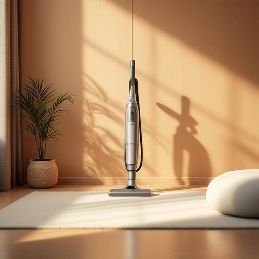

# vacuum

<h1 style="font-size: 2.5em; font-weight: 300; letter-spacing: 2px; margin: 0; color: #2c3e50;">
/ˈvækjum/
</h1>

---

---

## 例句

The concept of vacuum in physics refers to a space entirely devoid of matter, where no particles exist to interfere with the propagation of light or sound waves.

*The(/ðə/) concept(/ˈkɑnsɛpt/) of(/əv/) vacuum(/ˈvækjum/) in(/ɪn/) physics(/ˈfɪzɪks/) refers(/rɪˈfərz/) to(/tɪ/) a(/ə/) space(/speɪs/) entirely(/ɪnˈtaɪərli/) devoid(/dɪˈvɔɪd/) of(/əv/) matter,(/ˈmætər,/) where(/wɛr/) no(/noʊ/) particles(/ˈpɑrtɪkəlz/) exist(/ɪgˈzɪst/) to(/tɪ/) interfere(/ˌɪnərˈfɪr/) with(/wɪθ/) the(/ðə/) propagation(/ˌprɑpəˈgeɪʃən/) of(/əv/) light(/laɪt/) or(/ər/) sound(/saʊnd/) waves.(/weɪvz./)*

**翻译：** 物理学中的真空概念指的是一个完全没有物质存在的空间，在那里不存在任何粒子，从而不会干扰光波或声波的传播。

---

## 解释

在家居生活用品的语境中英语单词vacuum作为名词通常指吸尘器即一种利用吸力清洁地面或家具的电器设备具体使用时常见表达有vacuum cleaner简称为vacuum例如Im going to use the vacuum to clean the carpet我要用吸尘器清理地毯英语学习者需要注意作为名词时vacuum通常不可数指整体设备或抽象的真空状态时也适用但在家居环境中专指吸尘器常与动作动词如use run buy clean with搭配在语法上表达时要区分vacuum作为动词用吸尘器清理和名词吸尘器的用法避免混淆该词源自拉丁语vacuus意为空的最早用来形容真空状态18世纪后因吸尘设备利用空气压力差而得名逐渐引申为指吸尘器在中文语境中vacuum作为家居用品名词准确翻译为吸尘器并无褒贬色彩是一种中性实用的家用电器词汇无特殊文化内涵总之在家居生活用品相关表达中vacuum作为名词代表吸尘器时既承载了其原来空的词源意义又具备具体操作和日常使用的家居功能掌握其搭配和语法区分对英语学习者理解和运用十分重要

---

<small style="color: #999; font-size: 0.9em;">2025-07-27 09:14:04</small>

