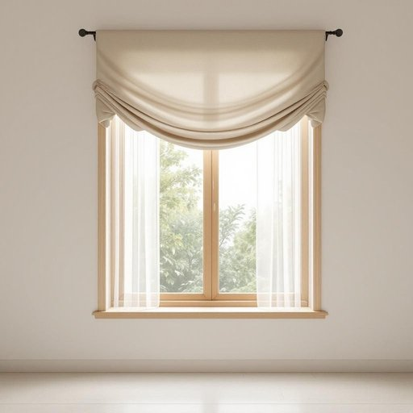

# valance

<h1 style="font-size: 2.5em; font-weight: 300; letter-spacing: 2px; margin: 0; color: #2c3e50;">
/valance*/
</h1>

---

---

## 例句

I asked Sarah to take a precise measurement of the bay window to ensure the valance we ordered would perfectly fit and enhance the overall room decoration.

*I(/aɪ/) asked(/æst/) Sarah(/ˈsɛrə/) to(/tɪ/) take(/teɪk/) a(/ə/) precise(/prɪˈsaɪs/) measurement(/ˈmɛʒərmənt/) of(/əv/) the(/ðə/) bay(/beɪ/) window(/ˈwɪndoʊ/) to(/tɪ/) ensure(/ɪnˈʃʊr/) the(/ðə/) valance(/valance*/) we(/wi/) ordered(/ˈɔrdərd/) would(/wʊd/) perfectly(/ˈpərfəktli/) fit(/fɪt/) and(/ənd/) enhance(/ɛnˈhæns/) the(/ðə/) overall(/ˈoʊvərˌɔl/) room(/rum/) decoration.(/ˌdɛkərˈeɪʃən./)*

**翻译：** 我请莎拉精确测量了飘窗的尺寸，以确保我们订购的窗帘饰边能够完美贴合，并提升整体房间的装饰效果。

---

## 解释

英语单词“valance”在家居生活用品领域作为名词，主要指窗帘顶部装饰的一种短帘或装饰布，通常用于遮盖窗帘轨道或窗框上部的结构，使窗饰整体更美观整洁。具体使用场合包括卧室、客厅或餐厅的窗户装饰，特别是在追求传统或经典风格家居环境中较为常见。英语学习者使用“valance”时应注意它的单数和复数形式分别为“valance”和“valances”，一般作为可数名词使用，且常与诸如“window valance”（窗帘罩）、“bed valance”（床罩，下垂于床边的装饰布）等词搭配，表达时常结合介词“with”或“attached to”描述其附着位置，如“valance attached to the curtain rod”。“Valance”一词来源于中古英语“valence”，继而源自古法语“valance”，最初指骑士披风，后引申为覆盖物，体现了其遮盖装饰的功能。在中文语境中，“valance”一般译为“窗帘罩”、“檐帘”或“装饰帘”，强调其在窗户顶部作为装饰和遮盖的作用，需避免混淆为窗帘的主体部分或其他家纺用品。此词语本身无明显褒贬色彩，多为中性词汇，但在现代简约装修流行趋势中，采用valance可能被视作传统或复古装饰风格的代表，体现一定的审美取向和生活品味。

---

<small style="color: #999; font-size: 0.9em;">2025-07-27 09:14:04</small>

