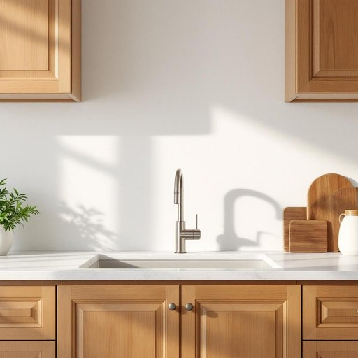

# valve

<h1 style="font-size: 2.5em; font-weight: 300; letter-spacing: 2px; margin: 0; color: #2c3e50;">
/vælv/
</h1>

---

---

## 例句

Before you call the plumber, could you please check if the valve under the sink, which controls the water flow to the kitchen taps, is fully open or if it might be clogged with debris, as that’s often the simplest reason for the sudden drop in water pressure?

*Before(/ˌbiˈfɔr/) you(/ju/) call(/kɔl/) the(/ðə/) plumber,(/ˈpləmər,/) could(/kʊd/) you(/ju/) please(/pliz/) check(/ʧɛk/) if(/ɪf/) the(/ðə/) valve(/vælv/) under(/ˈəndər/) the(/ðə/) sink,(/sɪŋk,/) which(/wɪʧ/) controls(/kənˈtroʊlz/) the(/ðə/) water(/ˈwɔtər/) flow(/floʊ/) to(/tɪ/) the(/ðə/) kitchen(/ˈkɪʧən/) taps,(/tæps,/) is(/ɪz/) fully(/ˈfʊli/) open(/ˈoʊpən/) or(/ər/) if(/ɪf/) it(/ɪt/) might(/maɪt/) be(/bi/) clogged(/klɔgd/) with(/wɪθ/) debris,(/dəˈbri,/) as(/ɛz/) that’s(/that’s*/) often(/ˈɔfən/) the(/ðə/) simplest(/ˈsɪmpləst/) reason(/ˈrizən/) for(/fər/) the(/ðə/) sudden(/ˈsədən/) drop(/drɔp/) in(/ɪn/) water(/ˈwɔtər/) pressure?(/ˈprɛʃər?/)*

**翻译：** 在您联系水管工之前，能否先检查一下水槽下方控制厨房水龙头水流的阀门是否完全打开，或者是否被杂物堵塞？因为这通常是水压突然下降的最简单原因。

---

## 解释

英语单词"valve"在家居生活用品场景中作为名词，主要指用于控制液体、气体等流动的装置，如水龙头阀门、管道阀门或气体瓶上的安全阀等具体部件。它常见于装修、维修、管道安装以及家用电器如热水器、暖气设备中，是调节和关闭流体流动的关键元件。英语学习者在使用"valve"时，应注意它通常作可数名词，用于指单个阀门，如"a valve"，且常与介词短语搭配出现，如"turn off the valve（关闭阀门）"、"open the valve（打开阀门）"、"water valve（水阀）"等，此外，"valve"通常指机械装置，不用于比喻义，语法上需避免混淆其复数形式"valves"。词源上，"valve"源自拉丁语"valva"，意为门板，指关闭或开启通道的装置，这一历史背景体现了阀门的基本功能，即控制开启和关闭。中文语境中，"valve"多译为“阀门”，准确表达其机械控制流体的功能，差别在于根据具体用途还有“水阀”、“气阀”、“安全阀”等具体称呼。该词无特殊褒贬或文化色彩，属于技术性较强的日常生活专业词汇，理解时应结合具体场景，如家中供水系统或采暖设备，以避免语义的泛化或误用。

---

<small style="color: #999; font-size: 0.9em;">2025-07-27 09:14:04</small>

