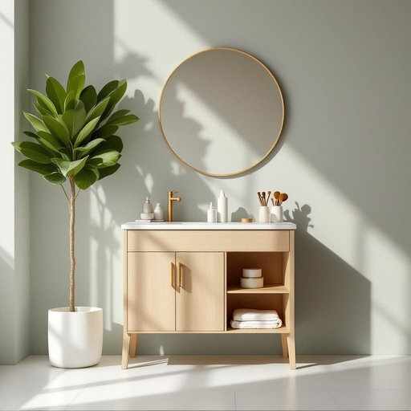

# vanity

<h1 style="font-size: 2.5em; font-weight: 300; letter-spacing: 2px; margin: 0; color: #2c3e50;">
/ˈvænɪti/
</h1>

---

---

## 例句

After struggling to find the perfect spot in the cramped bathroom, she finally decided to install a classic wooden vanity, which not only provided ample storage space for her skincare products and makeup brushes but also added a touch of elegance to the room, making the morning routine feel less rushed and more luxurious.

*After(/ˈæftər/) struggling(/ˈstrəgəlɪŋ/) to(/tɪ/) find(/faɪnd/) the(/ðə/) perfect(/ˈpərˌfɪkt/) spot(/spɑt/) in(/ɪn/) the(/ðə/) cramped(/kræmpt/) bathroom,(/ˈbæθˌrum,/) she(/ʃi/) finally(/ˈfaɪnəli/) decided(/ˌdɪˈsaɪdɪd/) to(/tɪ/) install(/ˌɪnˈstɔl/) a(/ə/) classic(/ˈklæsɪk/) wooden(/ˈwʊdən/) vanity,(/ˈvænɪti,/) which(/wɪʧ/) not(/nɑt/) only(/ˈoʊnli/) provided(/prəˈvaɪdɪd/) ample(/ˈæmpəl/) storage(/ˈstɔrɪʤ/) space(/speɪs/) for(/fər/) her(/hər/) skincare(/skincare*/) products(/ˈprɑdəkts/) and(/ənd/) makeup(/ˈmeɪˌkəp/) brushes(/ˈbrəʃɪz/) but(/bət/) also(/ˈɔlsoʊ/) added(/ˈædɪd/) a(/ə/) touch(/təʧ/) of(/əv/) elegance(/ˈɛləgəns/) to(/tɪ/) the(/ðə/) room,(/rum,/) making(/ˈmeɪkɪŋ/) the(/ðə/) morning(/ˈmɔrnɪŋ/) routine(/ruˈtin/) feel(/fil/) less(/lɛs/) rushed(/rəʃt/) and(/ənd/) more(/mɔr/) luxurious.(/ləgˈʒəriəs./)*

**翻译：** 经过一番努力在狭小的浴室里寻找理想的位置后，她最终决定安装一个经典的木质梳妆台。这个梳妆台不仅为她的护肤品和化妆刷提供了充足的储物空间，还为房间增添了一丝优雅，使得晨间护理变得不再匆忙，而更显奢华。

---

## 解释

在家居生活用品的语境中，英语单词“vanity”作为名词常指浴室中的“梳妆台”或“洗手台柜”，通常是带有镜子和储物空间的家具，方便个人整理仪容。具体使用场合多见于描述浴室或卧室布置，如“I installed a new vanity in the bathroom”（我在浴室安装了一个新的梳妆台）。英语学习者需注意“vanity”作为名词时既可指抽象的“虚荣心”，也指实物“梳妆台”，语境不同含义差异较大。语法上，“vanity”作为单数可数名词，复数形式为“vanities”，常与动词连用时根据数作相应变化。常见搭配有“bathroom vanity”（浴室梳妆台）、“vanity unit”（梳妆台柜）、“vanity mirror”（梳妆镜）等，表达时需结合上下文区分其具体指代。词源方面，“vanity”起源于中古英语，源自拉丁语“vanitas”，原意为“空虚”或“虚幻”，最初主要指人的虚荣心，后引申为相关物品名称。在中文语境中，当用于家居用品时，应准确翻译为“梳妆台”或“洗面台”，避免混淆为“虚荣心”等抽象含义。需要注意的是，作为家具用词时“vanity”无褒贬色彩，但其抽象用法常带有负面评价，涉及自负或不切实际的自我重视，这一点在文化理解上需特别区分，以免误用导致表达不当。

---

<small style="color: #999; font-size: 0.9em;">2025-07-27 09:14:04</small>

