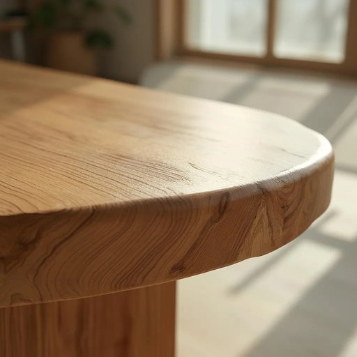

# varnish

<h1 style="font-size: 2.5em; font-weight: 300; letter-spacing: 2px; margin: 0; color: #2c3e50;">
/ˈvɑrnɪʃ/
</h1>

---

---

## 例句

Before you apply the second coat of varnish, which is designed to enhance the natural grain of the oak table, ensure that the surface is completely dry and free from dust to achieve a smooth and durable finish.

*Before(/ˌbiˈfɔr/) you(/ju/) apply(/əˈplaɪ/) the(/ðə/) second(/ˈsɛkənd/) coat(/koʊt/) of(/əv/) varnish,(/ˈvɑrnɪʃ,/) which(/wɪʧ/) is(/ɪz/) designed(/dɪˈzaɪnd/) to(/tɪ/) enhance(/ɛnˈhæns/) the(/ðə/) natural(/ˈnæʧərəl/) grain(/greɪn/) of(/əv/) the(/ðə/) oak(/oʊk/) table,(/ˈteɪbəl,/) ensure(/ɪnˈʃʊr/) that(/ðət/) the(/ðə/) surface(/ˈsərfəs/) is(/ɪz/) completely(/kəmˈplitli/) dry(/draɪ/) and(/ənd/) free(/fri/) from(/frəm/) dust(/dəst/) to(/tɪ/) achieve(/əˈʧiv/) a(/ə/) smooth(/smuð/) and(/ənd/) durable(/ˈdʊrəbəl/) finish.(/ˈfɪnɪʃ./)*

**翻译：** 在涂抹第二层清漆之前，该层旨在突出橡木桌的自然纹理，请确保表面完全干燥且无尘，以获得光滑且耐用的涂饰效果。

---

## 解释

英语单词“varnish”作为名词在家居生活用品场景中，主要指用于涂覆木器、家具或其他表面的透明保护膜或光泽层，通常为液体形式，涂抹后形成坚硬光亮的涂层以防止表面受损、发霉或褪色。具体使用场合多见于装修、家具制作或维护过程中，如“apply a coat of varnish on the wooden table”（在木桌上涂一层清漆）。英语学习者应注意“varnish”作为不可数名词时通常不用复数形式，且常与动词“apply,” “paint,” “coat”连用，常见搭配有“a coat of varnish”（一层清漆）、“varnish finish”（清漆表面）、“varnish remover”（清漆去除剂）等。此外，varnish也可以用作动词，意味着“涂清漆”，但此处重点为名词用法。该词起源于中古英语“varnish”，来自古法语“vernis”，进一步追溯至拉丁语“vernix”意为漆树的树脂，反映了其作为保护性树脂涂料的本质。在中文语境中，varnish准确翻译为“清漆”或“漆”，强调其透明保护层的功能，区别于“油漆”（paint）等含色彩的涂料。该词本身无褒贬色彩，但在文化上与“保护”和“美化”密切相关，常用于提升家居用品的美观和耐用性，体现了工艺和维护的细致要求。

---

<small style="color: #999; font-size: 0.9em;">2025-07-27 09:14:04</small>

