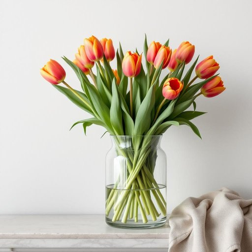

# vase

<h1 style="font-size: 2.5em; font-weight: 300; letter-spacing: 2px; margin: 0; color: #2c3e50;">
/vɑz/
</h1>

---

---

## 例句

Could you please place the delicate glass vase filled with fresh tulips on the mantelpiece, ensuring it’s far enough from the window to avoid direct sunlight that might cause the colours to fade too quickly?

*Could(/kʊd/) you(/ju/) please(/pliz/) place(/pleɪs/) the(/ðə/) delicate(/ˈdɛləkət/) glass(/glæs/) vase(/vɑz/) filled(/fɪld/) with(/wɪθ/) fresh(/frɛʃ/) tulips(/ˈtulɪps/) on(/ɔn/) the(/ðə/) mantelpiece,(/mantelpiece*,/) ensuring(/ɪnˈʃʊrɪŋ/) it’s(/it’s*/) far(/fɑr/) enough(/ɪˈnəf/) from(/frəm/) the(/ðə/) window(/ˈwɪndoʊ/) to(/tɪ/) avoid(/əˈvɔɪd/) direct(/dɪˈrɛkt/) sunlight(/ˈsənˌlaɪt/) that(/ðət/) might(/maɪt/) cause(/kɔz/) the(/ðə/) colours(/colours*/) to(/tɪ/) fade(/feɪd/) too(/tu/) quickly?(/kˈwɪkli?/)*

**翻译：** 请您将盛有鲜切郁金香的精致玻璃花瓶安放在壁炉架上，确保其距窗户足够远，以避免阳光直射导致花色过快褪色。

---

## 解释

英语单词“vase”作为名词，指的是一种用于插花或装饰的器皿，通常由玻璃、陶瓷、金属等材料制成，在家居生活中常用来摆放鲜花、美化环境。具体使用场合多见于描述家居布置、室内装饰或花艺相关情境，如“The vase on the table holds fresh roses”（桌上的花瓶插着新鲜的玫瑰）。英语学习者在使用“vase”时需注意其发音通常为/veɪs/，且其单数是vase，复数形式为vases，注意复数时发音为/ˈveɪsɪz/。常见搭配有“flower vase”（花瓶）、“decorative vase”（装饰花瓶）、“ceramic vase”（陶瓷花瓶）等，表达时应根据具体材质或用途灵活搭配。词源方面，“vase”源自拉丁语“vas”，意指容器或罐，经过法语“vase”借入英语，最初泛指各种盛装容器，后来特指用于插花的器皿。在中文语境中，“vase”准确翻译为“花瓶”，强调其作为插放花卉的器具功能，且通常带有美观、装饰性的含义，区别于其他容器如“罐”或“瓶”，更偏向于艺术与美化环境。该词语在英美文化中无褒贬含义，使用较为中性，体现的是家居美学和日常生活的雅致，因而在表达室内设计或情感寄托时常带有一定温馨和美好氛围。

---

<small style="color: #999; font-size: 0.9em;">2025-07-27 09:14:04</small>

