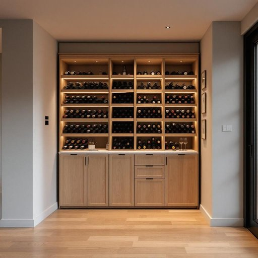

# vault

<h1 style="font-size: 2.5em; font-weight: 300; letter-spacing: 2px; margin: 0; color: #2c3e50;">
/vɔlt/
</h1>

---

---

## 例句

The cellar of the old house, recently transformed into a temperature-controlled wine vault with bespoke wooden racks and discreet LED lighting, has swiftly become my preferred place to store rare wine vintages and host cozy tastings with friends during cold winter nights.

*The(/ðə/) cellar(/ˈsɛlər/) of(/əv/) the(/ðə/) old(/oʊld/) house,(/haʊs,/) recently(/ˈrisəntli/) transformed(/trænsˈfɔrmd/) into(/ˈɪntu/) a(/ə/) temperature-controlled(/temperature-controlled*/) wine(/waɪn/) vault(/vɔlt/) with(/wɪθ/) bespoke(/bespoke*/) wooden(/ˈwʊdən/) racks(/ræks/) and(/ənd/) discreet(/dɪˈskrit/) LED(/lɛd/) lighting,(/ˈlaɪtɪŋ,/) has(/həz/) swiftly(/sˈwɪftli/) become(/bɪˈkəm/) my(/maɪ/) preferred(/prɪˈfərd/) place(/pleɪs/) to(/tɪ/) store(/stɔr/) rare(/rɛr/) wine(/waɪn/) vintages(/ˈvɪntɪʤɪz/) and(/ənd/) host(/hoʊst/) cozy(/ˈkoʊzi/) tastings(/ˈteɪstɪŋz/) with(/wɪθ/) friends(/frɛndz/) during(/ˈdʊrɪŋ/) cold(/koʊld/) winter(/ˈwɪntər/) nights.(/naɪts./)*

**翻译：** 老宅的地窖最近改造为温控酒窖，配备了定制的木质酒架和低调的LED照明，迅速成为我收藏珍稀老酒和在寒冷冬夜与好友温馨品酒的首选之地。

---

## 解释

英语单词“vault”在家居生活用品场景中作为名词，通常指一种坚固的储藏室或保险柜，主要用于安全存放贵重物品如现金、重要文件或珠宝等，这一用法多见于描述家中或银行环境里的安全设施。英语学习者在使用“vault”时应注意其为可数名词，常见搭配有“a vault door”（保险库门）、“a fireproof vault”（防火保险库）或“secure vault”（安全保险柜），表达时可用以强调其安全性和结构的坚固性。此外，“vault”还可以泛指拱顶结构，但这一含义在家居用品场景中不常用。词源上，“vault”来源于拉丁语“volta”，意为拱顶，因古代保险库常建于地下拱顶结构中而得此名，后来逐渐引申为保险柜或储藏室。中文语境下，“vault”准确译为“保险库”、“储藏库”或“地下金库”，强调其安全存储功能，不带褒贬色彩，属于中性词汇，主要体现安全保障和防护的文化内涵。

---

<small style="color: #999; font-size: 0.9em;">2025-07-27 09:14:04</small>

