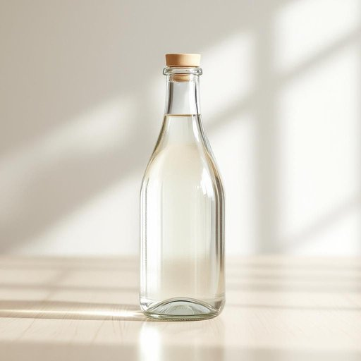

# vinegar

<h1 style="font-size: 2.5em; font-weight: 300; letter-spacing: 2px; margin: 0; color: #2c3e50;">
/ˈvɪnəgər/
</h1>

---

---

## 例句

Could you please check if we have any vinegar left in the cupboard, because I need the vinegar not only for the salad dressing I’m preparing, which requires a delicate balance of acidity, but also for cleaning the stubborn stains on the kitchen tiles that have been bothering me for weeks?

*Could(/kʊd/) you(/ju/) please(/pliz/) check(/ʧɛk/) if(/ɪf/) we(/wi/) have(/hæv/) any(/ˈɛni/) vinegar(/ˈvɪnəgər/) left(/lɛft/) in(/ɪn/) the(/ðə/) cupboard,(/ˈkəbərd,/) because(/bɪˈkəz/) I(/aɪ/) need(/nid/) the(/ðə/) vinegar(/ˈvɪnəgər/) not(/nɑt/) only(/ˈoʊnli/) for(/fər/) the(/ðə/) salad(/ˈsæləd/) dressing(/ˈdrɛsɪŋ/) I’m(/i’m*/) preparing,(/pərˈpɛrɪŋ,/) which(/wɪʧ/) requires(/rikˈwaɪərz/) a(/ə/) delicate(/ˈdɛləkət/) balance(/ˈbæləns/) of(/əv/) acidity,(/əˈsɪdəti,/) but(/bət/) also(/ˈɔlsoʊ/) for(/fər/) cleaning(/ˈklinɪŋ/) the(/ðə/) stubborn(/ˈstəbərn/) stains(/steɪnz/) on(/ɔn/) the(/ðə/) kitchen(/ˈkɪʧən/) tiles(/taɪlz/) that(/ðət/) have(/hæv/) been(/bɪn/) bothering(/ˈbɑðərɪŋ/) me(/mi/) for(/fər/) weeks?(/wiks?/)*

**翻译：** 请你帮忙检查一下橱柜里是否还有醋，因为我不仅需要它来调制沙拉酱，这道酱料讲究酸味的精妙平衡，还要用它来清洁困扰我数周的厨房瓷砖上的顽固污渍。

---

## 解释

英语单词"vinegar"作为名词，主要指厨房中常见的调味品“醋”，在家居生活用品的语境下通常用于描述烹饪调料或清洁剂。具体使用场合包括烹饪时添加酸味、腌制食物，或因其酸性成分用作天然清洁剂，如清洁厨房台面、水垢去除等。英语学习者使用该词时，需注意其不可数名词性质，常用搭配有“一瓶醋”（a bottle of vinegar），“白醋”（white vinegar），“苹果醋”（apple cider vinegar）等，表达时通常不用复数形式，且常与调味或清洁相关的动词搭配，如“在沙拉中加醋”（add vinegar to salad），“用醋清洁”（use vinegar for cleaning）。词源上，“vinegar”来自古法语“vinaigre”，意为“酸的酒”，来源于拉丁语“vinum”（酒）和“acer”（酸的），反映了醋由酒酸化而成的传统工艺。在中文语境中，"vinegar"准确翻译为“醋”，既指食用的调味品，也隐含天然无害的清洁用途，无特殊褒贬色彩，但在文化层面上，醋象征着酸味或带有轻微的“酸性”隐喻，如“吃醋”借用其酸涩特性表达嫉妒情绪。此外，“vinegar”作为家庭日常用品，强调其实用性和天然特点，适合在较正式或生活化的英语环境中使用。

---

<small style="color: #999; font-size: 0.9em;">2025-07-27 09:14:04</small>

