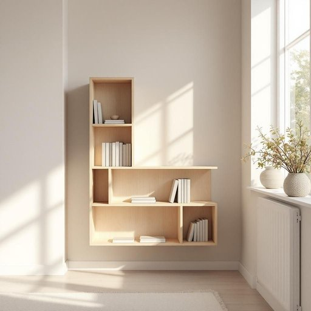

# wall

<h1 style="font-size: 2.5em; font-weight: 300; letter-spacing: 2px; margin: 0; color: #2c3e50;">
/wɔl/
</h1>

---

---

## 例句

Could you help me decide whether the new bookshelf would look better against the wall by the window, where it could catch natural light and create a cozy reading nook, or on the opposite wall, which is currently bare but might benefit from some decorative elements to balance the room's overall aesthetic?

*Could(/kʊd/) you(/ju/) help(/hɛlp/) me(/mi/) decide(/ˌdɪˈsaɪd/) whether(/ˈwɛðər/) the(/ðə/) new(/nu/) bookshelf(/ˈbʊkˌʃɛlf/) would(/wʊd/) look(/lʊk/) better(/ˈbɛtər/) against(/əˈgɛnst/) the(/ðə/) wall(/wɔl/) by(/baɪ/) the(/ðə/) window,(/ˈwɪndoʊ,/) where(/wɛr/) it(/ɪt/) could(/kʊd/) catch(/kæʧ/) natural(/ˈnæʧərəl/) light(/laɪt/) and(/ənd/) create(/kriˈeɪt/) a(/ə/) cozy(/ˈkoʊzi/) reading(/ˈrɛdɪŋ/) nook,(/nʊk,/) or(/ər/) on(/ɔn/) the(/ðə/) opposite(/ˈɑpəzɪt/) wall,(/wɔl,/) which(/wɪʧ/) is(/ɪz/) currently(/ˈkərəntli/) bare(/bɛr/) but(/bət/) might(/maɪt/) benefit(/ˈbɛnəfɪt/) from(/frəm/) some(/səm/) decorative(/ˈdɛkrətɪv/) elements(/ˈɛləmənts/) to(/tɪ/) balance(/ˈbæləns/) the(/ðə/) room's(/rumz/) overall(/ˈoʊvərˌɔl/) aesthetic?(/ɛsˈθɛtɪk?/)*

**翻译：** 你能帮我决定一下，新书架放在靠窗的那面墙上更合适吗？那里可以利用自然光，营造一个温馨的阅读角落；还是放在对面的那面墙上？那面墙目前空空如也，但可能通过一些装饰元素来平衡整个房间的整体美感。

---

## 解释

英语单词“wall”作为名词，在家居生活用品的语境中通常指房间或建筑物内部或外部用来分隔空间、支撑结构的垂直表面，即“墙壁”。具体使用场合包括描述家中不同房间之间的物理界限，如“the living room wall”（客厅墙壁）或“paint the walls”（粉刷墙壁），也可以指挂画、安装货架、固定插座的地方。英语学习者需要注意“wall”作可数名词，复数形式为“walls”，且常与介词短语搭配使用，如“on the wall”（在墙上）、“against the wall”（靠墙）；此外，短语“off the wall”含有“异想天开、古怪”的引申义，但在家居语境中一般不使用该比喻。词源方面，“wall”起源于古英语“weall”，源自拉丁语“vallum”，原指防御性的围墙，后来扩大为一般建筑中的墙体。中文语境中，“wall”准确翻译为“墙”或“墙壁”，强调的是结构性和功能性承重分隔的垂直面，没有褒贬色彩，但在文化层面，墙有时象征界限或隔阂。总体而言，作为家居生活用品名词，“wall”是描述家中空间结构和装饰的重要词汇，理解其基础含义和常见搭配对英语学习者有较大帮助。

---

<small style="color: #999; font-size: 0.9em;">2025-07-27 09:14:04</small>

