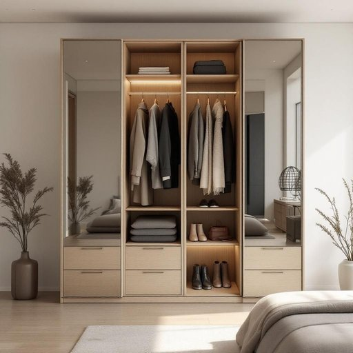

# wardrobe

<h1 style="font-size: 2.5em; font-weight: 300; letter-spacing: 2px; margin: 0; color: #2c3e50;">
/ˈwɔrˌdroʊb/
</h1>

---

---

## 例句

After struggling to find space for all her winter coats, scarves, and shoes, she finally decided to replace the old, creaky wardrobe in the bedroom with a larger, more modern one that not only featured mirrored doors but also included multiple compartments and built-in lighting, which made organizing her clothes much easier and more efficient.

*After(/ˈæftər/) struggling(/ˈstrəgəlɪŋ/) to(/tɪ/) find(/faɪnd/) space(/speɪs/) for(/fər/) all(/ɔl/) her(/hər/) winter(/ˈwɪntər/) coats,(/koʊts,/) scarves,(/skɑrvz,/) and(/ənd/) shoes,(/ʃuz,/) she(/ʃi/) finally(/ˈfaɪnəli/) decided(/ˌdɪˈsaɪdɪd/) to(/tɪ/) replace(/ˌriˈpleɪs/) the(/ðə/) old,(/oʊld,/) creaky(/ˈkriki/) wardrobe(/ˈwɔrˌdroʊb/) in(/ɪn/) the(/ðə/) bedroom(/ˈbɛˌdrum/) with(/wɪθ/) a(/ə/) larger,(/ˈlɑrʤər,/) more(/mɔr/) modern(/ˈmɑdərn/) one(/wən/) that(/ðət/) not(/nɑt/) only(/ˈoʊnli/) featured(/ˈfiʧərd/) mirrored(/ˈmɪrərd/) doors(/dɔrz/) but(/bət/) also(/ˈɔlsoʊ/) included(/ˌɪnˈkludɪd/) multiple(/ˈməltəpəl/) compartments(/kəmˈpɑrtmənts/) and(/ənd/) built-in(/ˈbɪlˌtɪn/) lighting,(/ˈlaɪtɪŋ,/) which(/wɪʧ/) made(/meɪd/) organizing(/ˈɔrgəˌnaɪzɪŋ/) her(/hər/) clothes(/kloʊðz/) much(/məʧ/) easier(/ˈiziər/) and(/ənd/) more(/mɔr/) efficient.(/ɪˈfɪʃənt./)*

**翻译：** 在为所有冬季大衣、围巾和鞋子寻找存放空间一番挣扎后，她最终决定用一款更大、更现代的衣柜替换卧室里那台陈旧摇晃的旧衣柜。新衣柜不仅配备了镜面门，还设有多个隔层和内置照明，这使得整理衣物变得更加轻松高效。

---

## 解释

英语单词"wardrobe"作为名词，在家居生活用品的语境中主要指用于存放衣物的家具，即衣柜或衣橱，常见于卧室或更衣间。"Wardrobe"通常是大型的带门的木制箱体，有时内部设有挂衣杆和搁板，方便整理和摆放各种衣服。使用场合多为描述住宅布局、家具配置或日常生活中整理衣物等情境。英语学习者在使用"wardrobe"时需注意其作为可数名词的用法，复数形式为"wardrobes"；此外，"wardrobe"还可引申表示某人拥有的全部衣服，当作集合名词时，语境需要明确。常见搭配包括"a built-in wardrobe"（内置衣柜）、"a sliding-door wardrobe"（推拉门衣柜）、"a wardrobe full of clothes"（满满一柜衣服）等。语法上"wardrobe"通常跟定冠词或不定冠词使用，也可以作为所有格出现，如"her wardrobe"。词源方面，"wardrobe"源自中古英语，合成自"ward"（守护、看管）和"robe"（长袍、衣服），最初指存放长袍和衣物的地方，体现了其“保护衣物”的功能。中文中，"wardrobe"通常准确翻译为“衣柜”或“衣橱”，强调其作为家具的实物属性；在中文语境下，有时"衣柜"一词较为通俗，而"衣橱"显得稍微正式或书面。该词本身无明显褒贬色彩，属于中性词汇，但在不同文化背景下，"wardrobe"也可能涉及生活品质或空间格局的暗示，例如大衣柜常被认为是生活品质的一种象征。总体而言，“wardrobe”作为家具名词，语义明确且实用，学习时应结合具体语境和搭配灵活使用。

---

<small style="color: #999; font-size: 0.9em;">2025-07-27 09:14:04</small>

