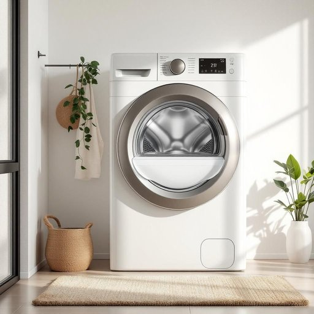

# washer

<h1 style="font-size: 2.5em; font-weight: 300; letter-spacing: 2px; margin: 0; color: #2c3e50;">
/ˈwɑʃər/
</h1>

---

---

## 例句

After we installed the new washer in the utility room, which not only has a larger capacity but also features an eco-friendly mode that significantly reduces water consumption, I finally felt relieved knowing that doing laundry would be both more efficient and environmentally responsible.

*After(/ˈæftər/) we(/wi/) installed(/ˌɪnˈstɔld/) the(/ðə/) new(/nu/) washer(/ˈwɑʃər/) in(/ɪn/) the(/ðə/) utility(/juˈtɪləti/) room,(/rum,/) which(/wɪʧ/) not(/nɑt/) only(/ˈoʊnli/) has(/həz/) a(/ə/) larger(/ˈlɑrʤər/) capacity(/kəˈpæsɪti/) but(/bət/) also(/ˈɔlsoʊ/) features(/ˈfiʧərz/) an(/ən/) eco-friendly(/eco-friendly*/) mode(/moʊd/) that(/ðət/) significantly(/sɪgˈnɪfɪkəntli/) reduces(/rɪˈdusɪz/) water(/ˈwɔtər/) consumption,(/kənˈsəmʃən,/) I(/aɪ/) finally(/ˈfaɪnəli/) felt(/fɛlt/) relieved(/rɪˈlivd/) knowing(/noʊɪŋ/) that(/ðət/) doing(/duɪŋ/) laundry(/ˈlɔndri/) would(/wʊd/) be(/bi/) both(/boʊθ/) more(/mɔr/) efficient(/ɪˈfɪʃənt/) and(/ənd/) environmentally(/ɪnˌvaɪrənˈmɛnəli/) responsible.(/riˈspɑnsəbəl./)*

**翻译：** 在我们把新洗衣机安装到杂物间后，这台洗衣机不仅容量更大，还配备了显著减少用水量的环保模式，我终于感到宽慰，因为洗衣既更加高效，又更环保了。

---

## 解释

英语单词“washer”作为家居生活用品中的名词，主要有两种常见含义：一是指用于洗衣的设备，即洗衣机；二是指机械装配中用于分散压力、防止松动的小金属垫圈，中文常译为垫圈或垫片。在家居语境下，通常指第一种，即洗衣机，这种电器用于清洗衣物，常见于家庭洗衣房或浴室内。学习者在使用“washer”时需注意其作为可数名词的用法，复数形式为washers，且在描述洗衣机时，常与形容词连用，如front-loading washer（前置式洗衣机）、top-loading washer（顶开式洗衣机），或与动词搭配如buy a washer（买洗衣机）、use the washer（使用洗衣机）。此外，washer在机械语境中指垫圈时，会常见于短语如flat washer（平垫圈）、spring washer（弹簧垫圈）。词源方面，washer源自古英语wæscan，意为洗涤，后通过化名词形式表示执行洗涤功能的物品，扩展到现代则指洗衣机。中文语境中，washer作为洗衣机的翻译较为准确，符合家居用语习惯，使用时无贬义或褒义色彩，但需根据上下文区分机械垫圈的含义，以避免误解。总之，washer在家庭生活用品中主要指洗衣机，是日常生活中常见且实用的名词，掌握其词义和搭配有助于准确表达和理解相关内容。

---

<small style="color: #999; font-size: 0.9em;">2025-07-27 09:14:04</small>

