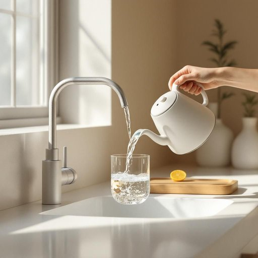

# water

<h1 style="font-size: 2.5em; font-weight: 300; letter-spacing: 2px; margin: 0; color: #2c3e50;">
/ˈwɔtər/
</h1>

---

---

## 例句

Could you please ensure the kettle is filled with fresh water from the tap to prepare the tea properly before the guests arrive this afternoon?

*Could(/kʊd/) you(/ju/) please(/pliz/) ensure(/ɪnˈʃʊr/) the(/ðə/) kettle(/ˈkɛtəl/) is(/ɪz/) filled(/fɪld/) with(/wɪθ/) fresh(/frɛʃ/) water(/ˈwɔtər/) from(/frəm/) the(/ðə/) tap(/tæp/) to(/tɪ/) prepare(/priˈpɛr/) the(/ðə/) tea(/ti/) properly(/ˈprɑpərli/) before(/ˌbiˈfɔr/) the(/ðə/) guests(/gɛsts/) arrive(/əraɪv/) this(/ðɪs/) afternoon?(/ˌæftərˈnun?/)*

**翻译：** 请您务必在客人今天下午抵达之前，用自来水将水壶注满新鲜的水，以确保茶能够妥善准备。

---

## 解释

英语单词“water”作为名词在家居生活用品的语境中，主要指日常生活中使用的清洁、饮用或烹饪用的水，如厨房用水、饮用水或用于浇灌植物的水，具体使用场合包括厨房、浴室、饮水机和花园中等。英语学习者需注意“water”作为不可数名词时通常不用复数形式，表示液体总体，如“I need some water”（我需要些水），但在特殊情况下表示某种类型或一类水体时可用复数waters，如“the waters of the lake”（湖水）；此外，“water”也常与动词“drink”，“boil”，“fill”等搭配，常见表达有“a glass of water”（一杯水）、“running water”（自来水）、“tap water”（自来水）、“bottled water”（瓶装水）等，后接量词或容器名词时需注意用量词形式。关于词源，“water”源自古英语“wæter”，与日耳曼语系的多个词汇同源，反映其作为生命基本要素的古老重要性。在中文语境中，“water”准确翻译为“水”，涵盖了液态水体的普遍概念，通常无褒贬色彩，作为生活必需品具备中性且重要的文化内涵，象征生命与纯净，使用时应根据具体语境确定指的是饮用水、自来水或其他类型的水，避免误用或泛化。

---

<small style="color: #999; font-size: 0.9em;">2025-07-27 09:14:04</small>

