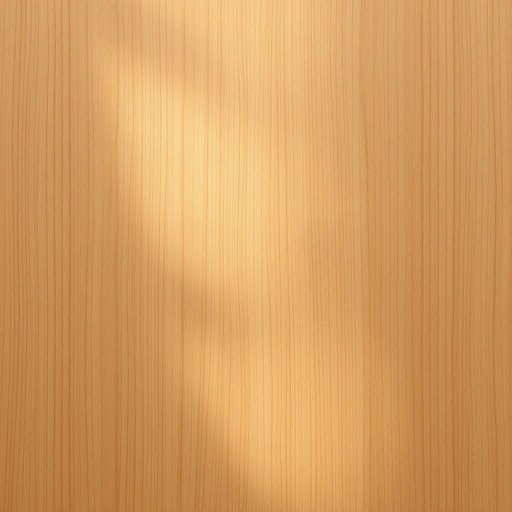

# wax

<h1 style="font-size: 2.5em; font-weight: 300; letter-spacing: 2px; margin: 0; color: #2c3e50;">
/wæks/
</h1>

---

---

## 例句

Before the wax on the wooden table fully dries, the delicate grain absorbs it deeply, creating a glossy finish that not only protects but also enhances the furniture’s natural beauty.

*Before(/ˌbiˈfɔr/) the(/ðə/) wax(/wæks/) on(/ɔn/) the(/ðə/) wooden(/ˈwʊdən/) table(/ˈteɪbəl/) fully(/ˈfʊli/) dries,(/draɪz,/) the(/ðə/) delicate(/ˈdɛləkət/) grain(/greɪn/) absorbs(/əbˈzɔrbz/) it(/ɪt/) deeply,(/ˈdipli,/) creating(/kriˈeɪtɪŋ/) a(/ə/) glossy(/ˈglɔsi/) finish(/ˈfɪnɪʃ/) that(/ðət/) not(/nɑt/) only(/ˈoʊnli/) protects(/prəˈtɛkts/) but(/bət/) also(/ˈɔlsoʊ/) enhances(/ɛnˈhænsɪz/) the(/ðə/) furniture’s(/furniture’s*/) natural(/ˈnæʧərəl/) beauty.(/ˈbjuti./)*

**翻译：** 在木桌上的蜡尚未完全干透之前，细腻的纹理便深深吸收了它，形成一层光泽的表面，不仅保护了家具，还提升了其天然的美感。

---

## 解释

英语单词“wax”作为名词在家居生活用品的语境中，通常指的是一种固态或半固态的可塑性物质，主要用于保护和装饰家具表面，使其光滑、有光泽，防止木材干裂或受潮。常见的使用场合包括对木制家具、地板或蜡烛的描述，如“furniture wax”（家具蜡）、“floor wax”（地板蜡）等，体现其保护和美容作用。英语学习者在使用“wax”作为名词时应注意其不可数名词性质，一般不加复数形式，且在搭配上常见表达包括“apply wax”（涂抹蜡）、“polish with wax”（用蜡擦光）、“beeswax”（蜂蜡，常用于天然蜡的特指）。此外，“wax”有时也与特定成分关联，如“paraffin wax”（石蜡），在语义上更为具体。词源方面，“wax”起源于古英语“weax”，与德语“Wachs”同源，原指蜂蜡，反映了其最初作为天然蜡的来源和使用。中文语境中，“wax”准确翻译为“蜡”，在家居用品领域常理解为能够覆盖和保护家具表面的一种材料，强调其物理性质和功能性。需要注意的是，“wax”作为名词本身无明显褒贬或特殊文化色彩，但其质地和用途使它在家居护理中具有积极、实用的正面含义。

---

<small style="color: #999; font-size: 0.9em;">2025-07-27 09:14:04</small>

