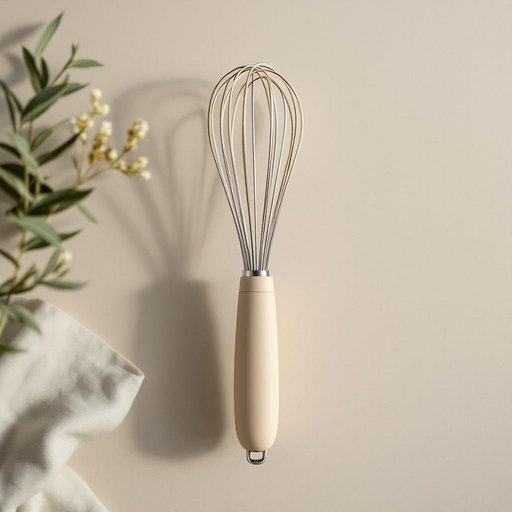

# whisk

<h1 style="font-size: 2.5em; font-weight: 300; letter-spacing: 2px; margin: 0; color: #2c3e50;">
/wɪsk/
</h1>

---

---

## 例句

The whisk that you handed me, which has a silicone handle and stainless steel wires, is perfect for beating the egg whites until they form stiff peaks before folding them gently into the batter.

*The(/ðə/) whisk(/wɪsk/) that(/ðət/) you(/ju/) handed(/ˈhændɪd/) me,(/mi,/) which(/wɪʧ/) has(/həz/) a(/ə/) silicone(/ˈsɪləˌkoʊn/) handle(/ˈhændəl/) and(/ənd/) stainless(/ˈsteɪnləs/) steel(/stil/) wires,(/waɪərz,/) is(/ɪz/) perfect(/ˈpərˌfɪkt/) for(/fər/) beating(/ˈbitɪŋ/) the(/ðə/) egg(/ɛg/) whites(/waɪts/) until(/ənˈtɪl/) they(/ðeɪ/) form(/fɔrm/) stiff(/stɪf/) peaks(/piks/) before(/ˌbiˈfɔr/) folding(/ˈfoʊldɪŋ/) them(/ðɛm/) gently(/ˈʤɛntli/) into(/ˈɪntu/) the(/ðə/) batter.(/ˈbætər./)*

**翻译：** 你递给我的这把搅拌器，配有硅胶手柄和不锈钢搅丝，非常适合将蛋白打发至硬性发泡，然后再轻轻地拌入面糊中。

---

## 解释

英语单词“whisk”作为家居生活用品中的名词，指的是一种厨房工具，通常由细长的金属丝环组成，用于快速搅打、搅拌液体或混合食材，如蛋液、奶油等。这种工具多见于烹饪和烘焙场合，尤其在制作蛋糕、煎饼和酱料时非常实用。英语学习者使用“whisk”作为名词时需要注意，其单复数形式规则变化为“whisks”，在句中常与动词“use”或“have”搭配，如“use a whisk to beat the eggs”或“a balloon whisk is ideal for whipping cream”，此外，“balloon whisk”是一种常见的具体类型表达，形象地描述其膨胀的形状以提升搅拌效果。在语法上，“whisk”作为名词不带复合意义，不可用作动词形式，避免混淆；作为动词时则有“迅速移动或搅打”的意思。词源上，“whisk”源自中古英语，可能模仿搅动、挥动的声音，体现其快速搅拌的功能，其根源与动词“whisk”相通。中文语境中，“whisk”准确翻译为“打蛋器”或“搅拌器”，是厨房中常见且实用的工具名词。此词无明显褒贬色彩，属于中性词汇，但文化上与家庭烹饪、细致烘焙技巧相关，体现一种精致、认真对待烹饪过程的态度。

---

<small style="color: #999; font-size: 0.9em;">2025-07-27 09:14:04</small>

