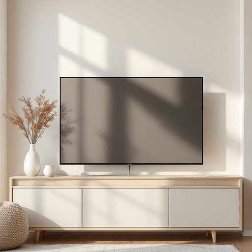

# wire

<h1 style="font-size: 2.5em; font-weight: 300; letter-spacing: 2px; margin: 0; color: #2c3e50;">
/waɪər/
</h1>

---

---

## 例句

Could you please check if the wire behind the TV is properly connected and not tangled with the other cables, as it’s been causing the sound system to cut out intermittently whenever we try to watch a film?

*Could(/kʊd/) you(/ju/) please(/pliz/) check(/ʧɛk/) if(/ɪf/) the(/ðə/) wire(/waɪər/) behind(/bɪˈhaɪnd/) the(/ðə/) TV(/ˌtɛləˈvɪʒən/) is(/ɪz/) properly(/ˈprɑpərli/) connected(/kəˈnɛktɪd/) and(/ənd/) not(/nɑt/) tangled(/ˈtæŋgəld/) with(/wɪθ/) the(/ðə/) other(/ˈəðər/) cables,(/ˈkeɪbəlz,/) as(/ɛz/) it’s(/it’s*/) been(/bɪn/) causing(/ˈkɔzɪŋ/) the(/ðə/) sound(/saʊnd/) system(/ˈsɪstəm/) to(/tɪ/) cut(/kət/) out(/aʊt/) intermittently(/ˌɪntərˈmɪtəntli/) whenever(/wɛˈnɛvər/) we(/wi/) try(/traɪ/) to(/tɪ/) watch(/wɔʧ/) a(/ə/) film?(/fɪlm?/)*

**翻译：** 请您检查电视后面的线是否连接牢固，并且没有与其他电缆纠缠在一起，因为每次我们尝试观看电影时，音响系统都会间歇性地断音。

---

## 解释

英语单词“wire”作为名词在家居生活用品场景中，通常指用金属制成的细长条状物，常见于家用电器的连接线、电线、灯具的导线或用于固定、绑扎的金属丝等，使用时语境多涉及电力传输、电子设备连接、安全设施安装等方面。英语学习者在使用“wire”时需注意其不可数和可数用法，表示一段具体的导线时可以用复数wires，但表示材质时通常不可数，如“copper wire”（铜线）；常见搭配包括“electrical wire”（电线）、“wire mesh”（铁丝网）、“wire cutter”（钢丝钳）等。此外，作动词时有“发电报”的意思，但此处限于名词用法。词源上，“wire”源自古英语“wire”，与古高地德语“wira”同源，意指金属丝，反映了其自古以来用于制作细长金属线材的用途。在中文语境中，“wire”应准确译为“金属丝”、“电线”或“导线”，根据具体用法而定，避免笼统翻译为“线”，以免混淆其他材质的线（如绳线、纱线）。总体来说，“wire”在家居生活中多为中性词，无褒贬色彩，但在安全提示中常出现，如“exposed wires”（裸露电线）暗示危险情境，需引起注意。

---

<small style="color: #999; font-size: 0.9em;">2025-07-27 09:14:04</small>

