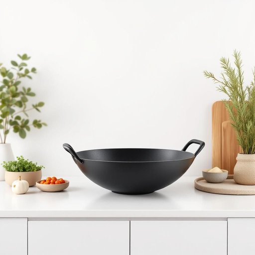

# wok

<h1 style="font-size: 2.5em; font-weight: 300; letter-spacing: 2px; margin: 0; color: #2c3e50;">
/wɑk/
</h1>

---

---

## 例句

After unpacking the groceries, she pulled the large, well-seasoned wok from the cabinet—which she’d bought last year during a kitchenware sale—knowing it would be perfect not only for stir-frying the fresh vegetables but also for simmering the fragrant sauce that her recipe called for.

*After(/ˈæftər/) unpacking(/ənˈpækɪŋ/) the(/ðə/) groceries,(/ˈgroʊsəriz,/) she(/ʃi/) pulled(/pʊld/) the(/ðə/) large,(/lɑrʤ,/) well-seasoned(/well-seasoned*/) wok(/wɑk/) from(/frəm/) the(/ðə/) cabinet—which(/cabinet—which*/) she’d(/she’d*/) bought(/bɔt/) last(/læst/) year(/jɪr/) during(/ˈdʊrɪŋ/) a(/ə/) kitchenware(/ˈkɪʧənˌwɛr/) sale—knowing(/sale—knowing*/) it(/ɪt/) would(/wʊd/) be(/bi/) perfect(/ˈpərˌfɪkt/) not(/nɑt/) only(/ˈoʊnli/) for(/fər/) stir-frying(/stir-frying*/) the(/ðə/) fresh(/frɛʃ/) vegetables(/ˈvɛʤtəbəlz/) but(/bət/) also(/ˈɔlsoʊ/) for(/fər/) simmering(/ˈsɪmərɪŋ/) the(/ðə/) fragrant(/ˈfreɪgrənt/) sauce(/sɔs/) that(/ðət/) her(/hər/) recipe(/ˈrɛsəpi/) called(/kɔld/) for.(/fər./)*

**翻译：** 收拾完杂货后，她从橱柜里拿出那口大而经过精心调味的炒锅——那是她去年趁厨具促销时买的——她知道这锅不仅非常适合快炒新鲜蔬菜，也能用来慢炖她食谱中所需的香浓酱汁。

---

## 解释

“wok”作为名词在家居生活用品的语境中，指的是一种传统的中式炒锅，通常为圆底或略微弧形的金属锅具，适合炒、煎、炸、蒸、炖等多种烹饪方式，广泛使用于亚洲尤其是中国家庭的厨房。使用“wok”时，常见的搭配有“wok cooking”（炒锅烹饪）、“wok stir-fry”（用炒锅快炒）、“non-stick wok”（不粘锅炒锅）等，语法上作为可数名词，可以用复数形式“woks”，并且前面常用冠词“a”或“the”。英语学习者需要注意“wok”多指特定形状和用途的锅，与一般意义上的“pan”或“pot”有区别，且通常用于烹饪相关表达中。这个词源自粤语“鑊”（发音近似wok），进入英语主要通过20世纪以来对中餐烹饪的文化交流和推广。中文语境中准确翻译为“炒锅”，强调其在中式烹饪中不可或缺的作用，既有功能性也带有文化标志的意味。该词通常无褒贬色彩，但作为文化符号，常被用以代表中国或东亚烹饪风格，体现中餐烹饪的独特技法和生活方式。

---

<small style="color: #999; font-size: 0.9em;">2025-07-27 09:14:04</small>

