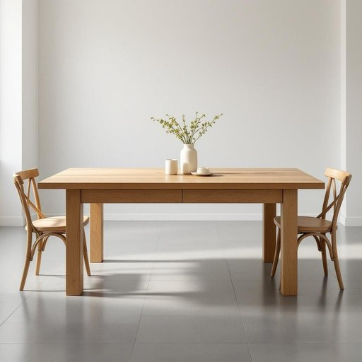

# wood

<h1 style="font-size: 2.5em; font-weight: 300; letter-spacing: 2px; margin: 0; color: #2c3e50;">
/wʊd/
</h1>

---

---

## 例句

The beautifully polished wooden dining table, crafted from reclaimed oak wood that was carefully sourced from old farmhouses, not only adds a warm, rustic charm to our living room but also serves as a sturdy centerpiece where the whole family gathers for meals and lively conversations.

*The(/ðə/) beautifully(/ˈbjutəfli/) polished(/ˈpɑlɪʃt/) wooden(/ˈwʊdən/) dining(/ˈdaɪnɪŋ/) table,(/ˈteɪbəl,/) crafted(/ˈkræftɪd/) from(/frəm/) reclaimed(/riˈkleɪmd/) oak(/oʊk/) wood(/wʊd/) that(/ðət/) was(/wɑz/) carefully(/ˈkɛrfəli/) sourced(/sourced*/) from(/frəm/) old(/oʊld/) farmhouses,(/ˈfɑrmˌhaʊsɪz,/) not(/nɑt/) only(/ˈoʊnli/) adds(/ædz/) a(/ə/) warm,(/wɔrm,/) rustic(/ˈrəstɪk/) charm(/ʧɑrm/) to(/tɪ/) our(/ɑr/) living(/ˈlɪvɪŋ/) room(/rum/) but(/bət/) also(/ˈɔlsoʊ/) serves(/sərvz/) as(/ɛz/) a(/ə/) sturdy(/ˈstərdi/) centerpiece(/ˈsɛntərˌpis/) where(/wɛr/) the(/ðə/) whole(/hoʊl/) family(/ˈfæməli/) gathers(/ˈgæðərz/) for(/fər/) meals(/milz/) and(/ənd/) lively(/ˈlaɪvli/) conversations.(/ˌkɑnvərˈseɪʃənz./)*

**翻译：** 这张经过精美打磨的木制餐桌，采用从古老农舍精心挑选回收的橡木制成，不仅为我们的客厅增添了温馨质朴的魅力，也成为坚固的中心家具，全家人在此围坐共进餐食，畅谈欢笑。

---

## 解释

英语单词“wood”作为名词在家居生活用品的语境中主要指由树木制成的材料，常用于家具、地板、橱柜、门窗等各种室内装饰和实用品，使用时一般强调天然材质的温暖质感和耐用性。具体使用场合包括描述家具材质如“a wooden table”，家居装修用料如“wood flooring”或工艺品材料等。学习者需要注意的是，“wood”作为不可数名词时表示材料整体，如“Wood is a renewable resource.”，而复数形式“woods”多指森林或树林，语义不同。此外，“wooden”作为形容词意为“木制的”，常与“wood”相关搭配使用。常见搭配有“piece of wood”（一块木头）、“wooden furniture”（木制家具）、“solid wood”（实木）、“wood grain”（木纹）等表达。词源上，“wood”源自古英语“wudu”，其含义自古至今基本稳定，指树木或其材料，体现了人类长期利用树木作为建材和生活必需品的文化传统。在中文语境中，“wood”准确应译为“木材”或“木头”，根据具体语境灵活选择，不应混淆为“树林”（常译为“woods”或“forest”）。该词无明显褒贬色彩，更多体现自然朴素和环保的文化内涵，常用于强调自然材质的美感和实用价值，是英语中描述家居生活用品时极为常见且基础的核心词汇。

---

<small style="color: #999; font-size: 0.9em;">2025-07-27 09:14:04</small>

