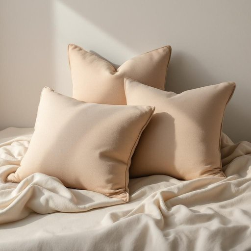

# wool

<h1 style="font-size: 2.5em; font-weight: 300; letter-spacing: 2px; margin: 0; color: #2c3e50;">
/wʊl/
</h1>

---

---

## 例句

Could you please check if the wool cushion covers I bought last week, which are not only incredibly soft but also made from sustainable fibres, have been washed properly and dried in the airing cupboard, as I want to make sure they retain their shape and warmth throughout the colder months?

*Could(/kʊd/) you(/ju/) please(/pliz/) check(/ʧɛk/) if(/ɪf/) the(/ðə/) wool(/wʊl/) cushion(/ˈkʊʃən/) covers(/ˈkəvərz/) I(/aɪ/) bought(/bɔt/) last(/læst/) week,(/wik,/) which(/wɪʧ/) are(/ər/) not(/nɑt/) only(/ˈoʊnli/) incredibly(/ˌɪnˈkrɛdəbli/) soft(/sɔft/) but(/bət/) also(/ˈɔlsoʊ/) made(/meɪd/) from(/frəm/) sustainable(/səˈsteɪnəbəl/) fibres,(/fibres*,/) have(/hæv/) been(/bɪn/) washed(/wɑʃt/) properly(/ˈprɑpərli/) and(/ənd/) dried(/draɪd/) in(/ɪn/) the(/ðə/) airing(/ˈɛrɪŋ/) cupboard,(/ˈkəbərd,/) as(/ɛz/) I(/aɪ/) want(/wɔnt/) to(/tɪ/) make(/meɪk/) sure(/ʃʊr/) they(/ðeɪ/) retain(/rɪˈteɪn/) their(/ðɛr/) shape(/ʃeɪp/) and(/ənd/) warmth(/wɔrmθ/) throughout(/θruaʊt/) the(/ðə/) colder(/ˈkoʊldər/) months?(/mənθs?/)*

**翻译：** 请您帮忙确认一下我上周购买的羊毛靠垫套是否已经妥善清洗，并在通风柜中晾干？这些靠垫套不仅手感极其柔软，而且采用可持续纤维制造，我希望确保它们在寒冷的季节里能够保持形状和保暖性。

---

## 解释

英语单词“wool”作为名词在家居生活用品语境中主要指动物的毛，尤其是羊毛，常用于制作毯子、毛衣、地毯等保暖或装饰性用品。具体使用场合多见于描述材质或产品成分时，如“a wool blanket”（羊毛毯）、“woolen socks”（羊毛袜）等，强调其温暖、柔软且具有吸湿性的特质。英语学习者需要注意，“wool”一般作为不可数名词使用，表示材质本身，如“I like wool because it is warm.”，同时也可以表示复数形式“wools”用于指不同种类的羊毛，但较少见；常见搭配有“wool sweater”、“wool fabric”、“wool yarn”等。词源上，“wool”源自古英语“wull”，与德语“Wolle”同源，反映了该词长期以来在欧洲畜牧社会中对羊毛这一重要纤维材料的认知和使用。在中文语境中，“wool”准确翻译为“羊毛”，强调其来自羊身上的纤维，常用来指衣物或家居用品中的天然纤维材料，没有褒贬色彩，但在文化上往往联想到温暖和舒适的家居氛围，是冬季保暖用品不可缺少的材料。

---

<small style="color: #999; font-size: 0.9em;">2025-07-27 09:14:04</small>

