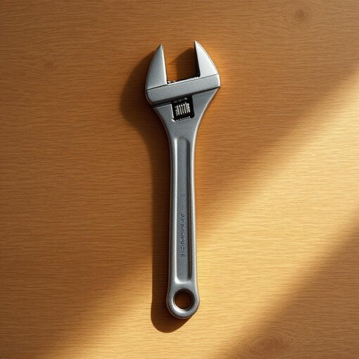

# wrench

<h1 style="font-size: 2.5em; font-weight: 300; letter-spacing: 2px; margin: 0; color: #2c3e50;">
/rɛnʧ/
</h1>

---

---

## 例句

I was trying to fix the leaking kitchen faucet, but without the proper wrench—which, as you know, is essential for gripping and turning pipes tightly—I couldn’t loosen the stubborn bolts that had corroded over time, so I had to ask my neighbour, who kindly lent me his adjustable wrench, allowing me to finally complete the repair without damaging any of the surrounding fixtures.

*I(/aɪ/) was(/wɑz/) trying(/traɪɪŋ/) to(/tɪ/) fix(/fɪks/) the(/ðə/) leaking(/ˈlikɪŋ/) kitchen(/ˈkɪʧən/) faucet,(/ˈfɔsət,/) but(/bət/) without(/wɪˈθaʊt/) the(/ðə/) proper(/ˈprɑpər/) wrench—which,(/wrench—which*,/) as(/ɛz/) you(/ju/) know,(/noʊ,/) is(/ɪz/) essential(/ɛˈsɛnʃəl/) for(/fər/) gripping(/ˈgrɪpɪŋ/) and(/ənd/) turning(/ˈtərnɪŋ/) pipes(/paɪps/) tightly—I(/tightly—i*/) couldn’t(/couldn’t*/) loosen(/ˈlusən/) the(/ðə/) stubborn(/ˈstəbərn/) bolts(/boʊlts/) that(/ðət/) had(/hæd/) corroded(/kərˈoʊdɪd/) over(/ˈoʊvər/) time,(/taɪm,/) so(/soʊ/) I(/aɪ/) had(/hæd/) to(/tɪ/) ask(/æsk/) my(/maɪ/) neighbour,(/ˈneɪbər,/) who(/hu/) kindly(/ˈkaɪndli/) lent(/lɛnt/) me(/mi/) his(/hɪz/) adjustable(/əˈʤəstəbəl/) wrench,(/rɛnʧ,/) allowing(/əˈlaʊɪŋ/) me(/mi/) to(/tɪ/) finally(/ˈfaɪnəli/) complete(/kəmˈplit/) the(/ðə/) repair(/rɪˈpɛr/) without(/wɪˈθaʊt/) damaging(/ˈdæmɪʤɪŋ/) any(/ˈɛni/) of(/əv/) the(/ðə/) surrounding(/sərˈaʊndɪŋ/) fixtures.(/ˈfɪksʧərz./)*

**翻译：** 我本想修理漏水的厨房水龙头，但没有合适的扳手，你也知道，扳手对于紧紧夹持和旋转管道至关重要，因此无法松动那些随着时间腐蚀而变得顽固的螺栓。于是我只好请求邻居帮忙，他慷慨地借给我他的活动扳手，才让我终于顺利完成了修理，且没有损坏周围的设施。

---

## 解释

英语单词“wrench”作为名词在家居生活用品的语境中，通常指一种用于拧紧或松开螺母、螺栓等机械零件的工具，中文常译为“扳手”或“板手”。具体使用场合多见于家居装配、家具维修、管道安装等需要手动调整固定件的场景。英语学习者在使用“wrench”时应注意其作为可数名词使用，一般前面会加冠词如a wrench或the wrench，且常与修理、工具相关的动词搭配，如use a wrench（使用扳手）、tighten with a wrench（用扳手拧紧），以及与具体工具类型搭配，如pipe wrench（管钳）、adjustable wrench（活动扳手）等，掌握这些常见搭配有助于准确表达。此外，“wrench”也可作动词，表示扭动的动作，但在家居用品中重点关注其作为名词工具的含义。该词源自古英语“wrencian”，意为扭动、拧紧，反映了其工具的基本功能。中文语境中，“wrench”准确理解为“扳手”，强调其手动机械操作性质，无褒贬色彩，是一种中性、日常工具词汇，使用时应避免与情感色彩强烈的“wrench”动词义混淆。总体而言，“wrench”作为家居生活中的工具名词，体现了实用性和功能性，是英语工具类词汇的重要组成部分，适合在日常维修和装配类话题中学习和使用。

---

<small style="color: #999; font-size: 0.9em;">2025-07-27 09:14:04</small>

